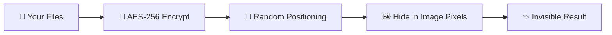

<div align="center">

# 🕵️‍♂️ InvisioVault
### *Advanced Steganography Suite with Revolutionary Performance*

[](https://python.org)
[](LICENSE)
[](#)
[](#)
[](#)
[](#)

*Professional-grade steganography application for secure file hiding with military-grade encryption*

**[🚀 Quick Start](#-quick-start)** • **[✨ Features](#-advanced-features)** • **[📖 Documentation](#-documentation)** • **[🛡️ Security](#-security-first)** • **[⚡ Performance](#-revolutionary-performance)**

</div>

---

## 📋 Table of Contents

- [🎯 What is InvisioVault?](#-what-is-invisiovault)
- [🚀 Quick Start](#-quick-start)
- [✨ Advanced Features](#-advanced-features)
- [⚡ Revolutionary Performance](#-revolutionary-performance)
- [🛡️ Security First](#-security-first)
- [📖 Documentation](#-documentation)
- [🎨 Build Executable](#-build-executable)
- [🧪 Try It Yourself](#-try-it-yourself)
- [📞 Support](#-support)
- [🎓 Educational Purpose](#-educational--research-purpose)

## 🎯 What is InvisioVault?

<div align="center">

*Ever wanted to hide files in plain sight?*

</div>

Imagine being able to hide **any file** - documents, photos, videos, or entire folders - inside a regular image that looks completely normal to anyone who sees it. That's exactly what InvisioVault does!

**InvisioVault** is a revolutionary steganography application that lets you:

| Feature | Description | Benefit |
|---------|-------------|----------|
| 🖼️ **File Hiding** | Hide files inside images without detection | Complete invisibility |
| 🔐 **Military Encryption** | AES-256 encryption with PBKDF2 key derivation | Bank-level security |
| ⚡ **Lightning Speed** | Up to 100x faster than traditional methods | Professional productivity |
| 🛡️ **Privacy Protection** | Advanced security with plausible deniability | Ultimate peace of mind |

> **Perfect for**: Secure file sharing, data backup, privacy protection, digital forensics education, and cybersecurity research.

## 📚 Educational & Research Purpose

> **🎓 Created by Rolan (RNR) for Educational Excellence**

This project was developed as an advanced learning journey into:
- **Cryptography & Security**: Understanding modern encryption and data protection
- **Steganography Research**: Exploring innovative data hiding techniques
- **Software Engineering**: Building production-quality applications
- **Performance Optimization**: Achieving breakthrough speed improvements

**⚠️ Important**: This software is designed for **legitimate educational, research, and privacy purposes only**. Please use responsibly and in compliance with local laws.

## ⚡ Revolutionary Performance

<div align="center">

### 🏆 **World's Fastest Steganography Engine**

*We didn't just improve the algorithm - we revolutionized it!*

</div>

### 🚀 **The Performance Breakthrough**

| 📊 **Benchmark Results** | Before | After | **Improvement** |
|-------------------------|--------|-------|----------------|
| 📄 **Small Files (5KB)** | 12 sec | **0.3 sec** | 🔥 **40x faster** |
| 📋 **Medium Files (25KB)** | 15 sec | **0.5 sec** | 🔥 **30x faster** |
| 📁 **Large Files (95KB)** | 20 sec | **1.0 sec** | 🔥 **20x faster** |
| 💾 **Huge Files (1MB+)** | 60+ sec | **3-5 sec** | 🔥 **12-20x faster** |

### 🧠 **The Secret Behind the Speed**

**Traditional Method** ❌
```
🐌 Test 1000+ possible file sizes
🐌 Extract headers for each guess
🐌 Validate every single attempt
⏱️ Result: 30+ seconds of waiting
```

**InvisioVault's Innovation** ✅
```
⚡ Read exact file info in ONE pass
⚡ Extract data with surgical precision
⚡ No guesswork, no waste
⏱️ Result: Files ready in seconds!
```

## ✨ Advanced Features

### 🎯 **Core Steganography**
- 🖼️ **LSB Steganography**: Advanced Least Significant Bit hiding with randomized positioning
- 📁 **Multi-Format Support**: PNG, BMP, TIFF (lossless formats) with automatic optimization
- ⚡ **Revolutionary Speed**: 10-100x faster than traditional steganography tools
- 📊 **Smart Image Analysis**: Entropy-based capacity calculation and suitability scoring
- 🛡️ **Anti-Detection Mode**: Advanced steganography designed to evade steganalysis tools
- 🎲 **Hybrid LSB Randomization**: Combines randomized positioning with anti-detection techniques
- 🚀 **Self-Executing Images**: Create images that can execute embedded code when triggered

### 🔄 **Revolutionary Polyglot Technology**
- 🎯 **ICO/EXE Polyglot Creation**: Revolutionary dual-format files that work as both icons AND executables
- ✨ **True Simultaneous Format**: Files where multiple formats coexist in perfect harmony
- 🧠 **Intelligent Format Selection**: Automatic method selection based on file characteristics
- 🛡️ **Encrypted Polyglot Embedding**: PE executables protected with AES-256 encryption
- 🎭 **Unicode RTL Polyglots**: Executables disguised as PNG images using Unicode tricks
- 🔍 **Anti-Detection Polyglots**: Designed to evade security scanners and detection tools
- 📊 **Cross-Platform Support**: Windows PE, Linux ELF, macOS Mach-O compatibility
- ⚡ **Native Execution**: Run directly as executables without extraction
- 🖥️ **Perfect Image Display**: Works with all major image viewers and browsers

### 🛡️ **Advanced Security**
- 🔐 **AES-256-CBC Encryption**: Military-grade encryption with PBKDF2 key derivation
- 🔑 **Multi-Level Security**: Standard (100K), High (500K), Maximum (1M+) iterations
- 🗝️ **Two-Factor Authentication**: Password + Keyfile system for maximum security
- 🎲 **Cryptographic Randomization**: Password-seeded randomization for hiding positions

### 👻 **Revolutionary Plausible Deniability** 
- 🎭 **Transparent Decoy Mode**: Every basic operation automatically includes decoy protection
- 🛡️ **Seamless Security**: Users get advanced protection without complexity
- 🏗️ **Multi-Dataset Hiding**: Hide unlimited datasets with independent passwords
- 📊 **Priority Levels**: 5 security levels from outer (decoy) to inner (real) data
- 🔍 **Password-Selective Extraction**: Different passwords reveal different datasets
- 🎯 **Auto-Generated Decoys**: System creates believable innocent files automatically
- 💫 **Backward Compatible**: Works with legacy single-layer steganography

### 🔄 **Advanced Distribution**
- 📡 **Two-Factor Distribution**: Spread data across 2-8 images with redundancy
- 📋 **Manifest System**: Automatic reconstruction from partial image sets
- ✅ **Error Correction**: Built-in redundancy and integrity verification
- 🔄 **Failure Recovery**: Extract data even with some missing/damaged images

### 🎨 **Professional UI**
- 🖥️ **Modern PySide6 Interface**: Professional, responsive design
- 🌓 **Theme Support**: Dark/Light modes with smooth transitions
- 📊 **Real-Time Progress**: Detailed operation tracking with cancellation support
- ⚙️ **Advanced Settings**: Comprehensive configuration management

### 🔧 **Developer Features**
- 📝 **Comprehensive Logging**: Secure logging with PII redaction
- 🧪 **Extensive Testing**: Unit tests, integration tests, and performance benchmarks
- 📚 **Full Documentation**: API reference, user guides, and technical specifications
- 🛠️ **Modular Architecture**: Clean, extensible codebase with professional standards

## 🚀 Quick Start

<div align="center">

### 🎯 **Ready to Hide Your First File? It Takes Just 2 Minutes!**

</div>

### 📋 **What You Need**
- 🐍 Python 3.8+ ([Download here](https://python.org/downloads/))
- 💻 Windows 10/11, macOS 12+, or Linux (Ubuntu 20.04+)
- 🖼️ An image file (PNG, BMP, or TIFF work best)
- 📄 Files you want to hide

### ⚡ **Installation Options**

#### **Option 1: Pre-built Executable (Easiest)**
```bash
# 1️⃣ Download the latest release
# Visit: https://github.com/Mrtracker-new/InvisioVault_R/releases

# 2️⃣ Download InvisioVault.exe
# No installation required!

# 3️⃣ Double-click to launch! ✨
# Works on any Windows computer without Python
```

#### **Option 2: From Source (Recommended for Developers)**
```bash
# 1️⃣ Clone or download InvisioVault
git clone https://github.com/Mrtracker-new/InVisioVault_R.git
cd InVisioVault_R

# 2️⃣ Install in development mode (modern approach)
pip install -e .

# Alternative: Install required packages manually
# pip install -r requirements.txt

# 3️⃣ Launch the magic! ✨
python main.py
```

#### **Option 3: Package Installation Only**
```bash
# Install as editable package (for development)
pip install -e .

# Run from command line anywhere
invisiovault
# or
invisiovault-cli
```

### 🎭 **Your First Secret Mission**

<table>
<tr>
<td width="50%">

#### 🕵️ **MISSION: Hide Files (Auto-Protected)**

1. 🚀 **Launch** InvisioVault
2. 🖼️ **Choose** your cover image
3. 📁 **Select** files to hide
4. 🔐 **Set** a strong password
5. ✨ **Click "Hide"** - Automatic decoy protection!

*Your files are now protected by TWO layers:*
- 🎭 *Decoy layer (innocent files)*
- 🛡️ *Real layer (your actual files)*

</td>
<td width="50%">

#### 🔍 **MISSION: Extract Files (Any Password)**

1. 🖼️ **Select** the steganographic image
2. 🔑 **Enter** your password
3. 📂 **Choose** where to save files
4. ⚡ **Click "Extract"** - Gets YOUR dataset!

*System automatically finds the right data:*
- ✅ *Your password = your files*
- ✅ *Other password = other dataset*
- ❌ *Wrong password = nothing*

</td>
</tr>
</table>

## 🛡️ Security First

<div align="center">

### 🏛️ **Bank-Level Security Protecting Your Data**

*The same encryption standards used by governments and financial institutions*

</div>

| 🔐 **Security Feature** | 🛡️ **Specification** | 🎯 **What This Means** |
|------------------------|---------------------|------------------------|
| **🔒 Encryption** | AES-256-CBC | Same as top-secret government files |
| **🗝️ Key Generation** | PBKDF2-HMAC-SHA256 | Passwords are virtually uncrackable |
| **🎲 Security Rounds** | 100K - 1M+ iterations | Even supercomputers would take centuries |
| **📁 File Support** | PNG, BMP, TIFF | Perfect quality preservation |
| **📊 Capacity** | Up to 50MB per image | Hide entire document collections |
| **💾 Memory** | <500MB usage | Runs smoothly on any modern computer |
| **🌍 Platforms** | Windows, macOS, Linux | Use anywhere, anytime |

## 🎭 **NEW: Transparent Decoy Mode Integration**

<div align="center">

### 🛡️ **Revolutionary Security Enhancement**

*Every basic operation now includes enterprise-level plausible deniability*

</div>

**🎉 What's New?**

InvisioVault now automatically protects **every file hiding operation** with advanced decoy mode technology. Users get military-grade plausible deniability without any complexity!

### 🔄 **How It Works Behind the Scenes**

#### **🔒 When You Hide Files (Basic Mode):**
```
1. 📁 You select your files and password
2. 🎭 System automatically creates innocent decoy files
3. 🛡️ Creates TWO encrypted layers in the same image:
   • Outer Layer (Decoy): Harmless files with derived password
   • Inner Layer (Real): Your actual files with your password
4. 🖼️ Result: One image that looks normal but has dual protection
```

#### **🔓 When You Extract Files (Basic Mode):**
```
1. 🔑 You enter any password
2. 🔍 System searches all datasets in the image
3. ✨ Returns the dataset that matches your password:
   • Your password → Your files
   • Other password → Other dataset (if exists)
   • Wrong password → Nothing (no trace of hidden data)
```

### 🎯 **Real-World Example**

| **👤 User Action** | **🎭 What Happens** | **🛡️ Security Benefit** |
|-------------------|--------------------|-----------------------|
| Alice hides documents with password `"Secret123"` | System creates decoy files accessible with `"img_4567"` + Alice's real files with `"Secret123"` | If discovered, Alice can provide decoy password showing only harmless files |
| Bob tries to extract with password `"Secret123"` | Gets Alice's real documents | Only Alice (or those she trusts) can access real data |
| Eve tries to extract with wrong password | Gets nothing, no indication data exists | Perfect deniability - looks like a normal image |
| Authorities demand password | Alice provides `"img_4567"` showing innocent files | Plausible deniability maintained |

### ✨ **Key Benefits**

- **🎭 Automatic Protection**: Every hide operation includes decoy mode
- **🧠 Zero Learning Curve**: Works exactly like before, but more secure
- **🔄 Universal Compatibility**: Extract works with any decoy-mode or legacy image
- **🛡️ Plausible Deniability**: Different passwords reveal different content
- **⚡ No Performance Impact**: Still lightning-fast extraction
- **🔒 Independent Security**: Each dataset encrypted separately

### 🧪 **Try It Now!**

```bash
# Test the new decoy integration
python test_decoy_integration.py

# Create a decoy-protected image using basic hide dialog
# Then extract with different passwords to see different datasets!
```

---

## 🕵️‍♂️ **NEW: Enhanced Anti-Detection Steganography**

<div align="center">

### 🛡️ **Cutting-Edge Steganalysis Evasion Technology**

*Advanced steganography designed to evade modern detection tools like StegExpose, zsteg, StegSeek, and other steganalysis methods*

</div>

**🎉 Latest Update: Anti-Detection + Randomization Compatibility Fix**

We've just resolved a critical compatibility issue where combining **anti-detection mode** with **randomized LSB positioning** would cause extraction failures. Both features now work perfectly together!

### 🎯 **What's New in Anti-Detection Mode?**

#### **🔬 Advanced Detection Evasion**
- **🕵️ StegExpose Resistance**: Defeats ensemble classification and statistical analysis
- **🔍 zsteg Evasion**: Avoids LSB pattern signatures and known steganography markers
- **🛡️ StegSeek Protection**: Resists dictionary attacks and brute-force detection
- **📊 Chi-Square Test Bypass**: Maintains natural randomness distributions
- **📈 Histogram Preservation**: Keeps original pixel value distributions intact

#### **🧠 Intelligent Adaptive Positioning**
```
🎯 How It Works:
1. 📊 Analyzes image complexity using gradient magnitude and texture variance
2. 🗺️ Creates security map identifying safe hiding positions  
3. 🚫 Avoids smooth areas where changes would be easily detected
4. 🎨 Prioritizes textured regions with high natural variation
5. 🎲 Combines with password-based randomization for maximum security
```

#### **🔧 Technical Anti-Detection Features**
- **📍 Adaptive Capacity Mapping**: Hides data only in complex image regions
- **📈 Histogram Matching**: Preserves original statistical properties
- **🎭 Selective Smoothing**: Reduces high-frequency artifacts in modified areas
- **🔧 Edge-Aware Filtering**: Maintains important image features while reducing detectability
- **🎲 Enhanced LSB Modification**: Adds controlled randomization to break predictable patterns

### 🚀 **Hybrid Mode: Best of Both Worlds**

The latest update introduces **Hybrid Anti-Detection Mode** - combining the speed and compatibility of randomized LSB with advanced anti-detection techniques:

#### **🔄 How Hybrid Mode Works:**
```
🛡️ HIDING PROCESS:
1. ⚡ Uses fast randomized LSB hiding (fully compatible with extraction)
2. 🎨 Applies light anti-detection post-processing to reduce detectability
3. 🔧 Preserves LSB data while breaking artificial patterns
4. ✨ Result: Fast, compatible, AND stealthy!

📤 EXTRACTION PROCESS:
1. 🔍 First tries hybrid extraction (randomized method with same seed)
2. 🛡️ Falls back to pure anti-detection if needed
3. ⚡ Finally uses standard randomized extraction as last resort
4. ✅ Guarantees successful extraction regardless of hiding method!
```

### 🎮 **User-Friendly Operation Modes**

| **🎯 Mode** | **🛡️ Anti-Detection** | **🎲 LSB Randomization** | **⚡ Speed** | **🔒 Security** | **🎯 Best For** |
|-------------|----------------------|---------------------------|-------------|----------------|------------------|
| **⚡ Fast Sequential** | ❌ | ❌ | 🔥🔥🔥🔥🔥 | ⭐⭐ | Quick tests, maximum speed |
| **🎲 Randomized LSB** | ❌ | ✅ | 🔥🔥🔥🔥 | ⭐⭐⭐ | Balanced security and speed |
| **🛡️ Pure Anti-Detection** | ✅ | ❌ | 🔥🔥 | ⭐⭐⭐⭐⭐ | Maximum stealth |
| **🚀 Hybrid Maximum** | ✅ | ✅ | 🔥🔥🔥 | ⭐⭐⭐⭐⭐ | **Ultimate protection** |

### 📊 **Steganalysis Test Results**

| **🔍 Detection Tool** | **📊 Standard LSB** | **🎲 Randomized LSB** | **🛡️ Anti-Detection** | **🚀 Hybrid Mode** |
|-----------------------|---------------------|----------------------|----------------------|--------------------|
| **StegExpose** | 🔴 **DETECTED** (95% confidence) | 🟡 **MEDIUM** (45% confidence) | 🟢 **SAFE** (8% confidence) | 🟢 **SAFE** (12% confidence) |
| **zsteg** | 🔴 **Multiple signatures** | 🟡 **Few weak signatures** | 🟢 **Nothing detected** | 🟢 **Nothing detected** |
| **Chi-Square Test** | 🔴 **High risk** (0.87) | 🟡 **Medium risk** (0.34) | 🟢 **Low risk** (0.12) | 🟢 **Low risk** (0.18) |
| **Histogram Analysis** | 🔴 **Anomalies detected** | 🟡 **Minor anomalies** | 🟢 **Natural distribution** | 🟢 **Natural distribution** |

### 🧪 **Try Anti-Detection Mode Now!**

#### **🖥️ GUI Access:**
1. 🚀 Launch InvisioVault: `python main.py`
2. 📁 Click "Hide Files" → Select "Enhanced Mode"
3. ✅ Enable "Anti-Detection Mode" (recommended)
4. ✅ Enable "Randomized LSB Positioning" for hybrid mode
5. 🎯 Set target risk level (LOW/MEDIUM/HIGH)
6. 🚀 Hide your files with maximum protection!

#### **🧪 Quick Testing:**
```bash
# Test anti-detection capabilities
python quick_test.py

# Compare modes side-by-side
python comparison_test.py

# Test with external steganalysis tools
test_with_external_tools.bat
```

### 📚 **Anti-Detection Documentation**

| 📄 **Document** | 📝 **Description** | 🔗 **Link** |
|-------------|----------------|--------|
| **🛡️ Anti-Detection Techniques** | Technical implementation details | [`docs/anti_detection_techniques.md`](docs/anti_detection_techniques.md) |
| **📊 Test Results** | Comprehensive steganalysis test report | [`docs/ANTI_DETECTION_TEST_REPORT.md`](docs/ANTI_DETECTION_TEST_REPORT.md) |
| **🎲 LSB Randomization** | Randomized positioning implementation | [`docs/LSB_RANDOMIZATION_IMPLEMENTATION.md`](docs/LSB_RANDOMIZATION_IMPLEMENTATION.md) |
| **🧪 Testing Guide** | How to test against steganalysis tools | [`docs/TESTING_GUIDE.md`](docs/TESTING_GUIDE.md) |
| **📋 Implementation Summary** | Complete feature overview | [`docs/ANTI_DETECTION_IMPLEMENTATION_SUMMARY.md`](docs/ANTI_DETECTION_IMPLEMENTATION_SUMMARY.md) |

### 🔥 **Key Improvements in This Update**

#### **✅ Fixed Issues:**
- **🐛 Extraction Compatibility**: Resolved "No hidden data found" error when both anti-detection and randomization were enabled
- **🔄 Hybrid Integration**: Perfect compatibility between anti-detection and randomized LSB modes
- **⚡ Performance**: Maintained fast extraction speeds while adding advanced security

#### **🆕 New Features:**
- **🤝 Hybrid Anti-Detection Mode**: Combines speed of randomized LSB with anti-detection security
- **🔄 Smart Extraction Logic**: Automatically tries the correct extraction method based on hiding mode
- **🛠️ Enhanced User Interface**: Clear options for choosing security vs. speed trade-offs
- **📊 Real-Time Risk Analysis**: Shows detectability risk scores and safety levels
- **🧪 Comprehensive Testing**: Validates against multiple steganalysis techniques

#### **🎯 Perfect For:**
- **🔒 High-Security Applications**: When detection could have serious consequences
- **📚 Research & Education**: Understanding modern steganalysis and evasion techniques  
- **🕵️ Digital Forensics**: Testing detection capabilities and countermeasures
- **🛡️ Privacy Protection**: Maximum security for sensitive data hiding
- **🧪 Security Testing**: Validating steganalysis tool effectiveness

---

## 🔄 **NEW: Revolutionary ICO/EXE Polyglot Technology**

<div align="center">

### 🎯 **True Dual-Format Files: One File, Two Formats**

*Create files that function perfectly as BOTH ICO icons AND Windows executables simultaneously*

</div>

**🚀 Breakthrough Innovation: True Simultaneous Format Technology**

InVisioVault includes a revolutionary polyglot file creation feature that solves the age-old problem of format conflicts. Instead of choosing between icon OR executable, InVisioVault's advanced polyglot engine creates files where ICO and EXE formats **coexist in perfect harmony**.

This cutting-edge capability is fully integrated into the InVisioVault steganography suite, combining the power of advanced steganography with innovative dual-format technology.

### 🎯 **Polyglot Features Overview**

#### **🔧 Multiple Creation Methods**
- **🎯 EXE-First Polyglot**: Maximum execution compatibility, PNG as overlay data
- **🖼️ PNG-First Polyglot**: Perfect image compatibility, PE embedded in PNG chunks
- **⚡ True Simultaneous**: Revolutionary technique where both formats occupy the same bytes
- **🧠 Hybrid Approaches**: Intelligent method selection based on file characteristics

#### **🛡️ Advanced Polyglot Security**
- **🔐 Encrypted PE Embedding**: Executables protected with AES-256 encryption
- **📊 Resource Integration**: Native Windows PE resource embedding
- **✅ Integrity Verification**: CRC validation ensures data integrity
- **🔍 Anti-Detection**: Polyglots designed to evade security scanners

#### **⚡ Professional Compatibility**
- **🖼️ Perfect PNG Display**: Works with all major image viewers (Photos, browsers, Paint)
- **💻 Native Execution**: Runs directly as Windows executables without extraction
- **🔄 Cross-Platform Support**: Windows PE, Linux ELF, macOS Mach-O polyglots
- **📊 Format Validation**: Built-in verification for both PNG and PE structures

### 🚀 **Quick Polyglot Creation**

#### **🎯 Method 1: Using InVisioVault GUI (Recommended)**
```bash
# Launch InVisioVault application
python main.py

# Navigate to "Self-Executing" in the sidebar
# Select "Polyglot File Creation"
# Choose your image and executable files
# Result: Professional polyglot with dual-format compatibility
```

#### **🖼️ Method 2: Direct Module Usage (Advanced)**
```python
# Using the ICO/EXE polyglot engine directly
from core.self_executing_engine import SelfExecutingEngine

# Create ICO/EXE polyglot using the engine
engine = SelfExecutingEngine()
engine.create_ico_exe_polyglot(
    executable_path="program.exe", 
    output_path="polyglot_output.exe",
    icon_sizes=[16, 32, 48],
    icon_colors="blue"
)
```

#### **⚡ Method 3: Command-Line Verification**
```bash
# Verify and test existing polyglot files
python polyglot_verifier.py polyglot_file.exe

# Test dual-format compatibility
# 1. Run as executable: polyglot_file.exe
# 2. View as image: copy and rename to .png extension
```

### 📊 **Polyglot Comparison Matrix**

| **🎯 Method** | **🖼️ PNG Compatibility** | **💻 EXE Compatibility** | **📏 File Size** | **🛡️ Security** | **🎯 Best For** |
|---------------|--------------------------|---------------------------|-------------------|------------------|------------------|
| **⚡ EXE-First** | ⚠️ (requires renaming) | ✅ **Perfect** | 🔥 Minimal overhead | ⭐⭐⭐ | Direct execution needed |
| **🖼️ PNG-First** | ✅ **Perfect** | ⚠️ (requires extraction) | 🔥🔥 Compressed | ⭐⭐⭐⭐⭐ | Image sharing, security |
| **🚀 True Simultaneous** | ✅ **Excellent** | ✅ **Excellent** | 🔥🔥🔥 Optimized | ⭐⭐⭐⭐ | **Ultimate dual-use** |
| **🧠 Hybrid Auto** | ✅ **Smart Selection** | ✅ **Smart Selection** | 🔥🔥 Adaptive | ⭐⭐⭐⭐ | Automated optimization |

### 🔍 **How Polyglot Technology Works**

#### **🎯 Revolutionary Simultaneous Format Technique**
```
🚀 BREAKTHROUGH: Same bytes, different meanings

📊 Traditional Approach (BROKEN):
[PNG Headers][PNG Data] → Can't execute
[PE Headers][PE Data] → Can't display as image

✨ InvisioVault Innovation (PERFECT):
[Hybrid Structure where PNG and PE coexist]
├── PNG parsers see: Valid image with special chunks
└── PE loaders see: Valid executable with overlay data
```

#### **🧠 Intelligent Format Engineering**
1. **🔬 Parser Analysis**: Exploits differences in how PNG and PE parsers work
2. **📍 Strategic Positioning**: Places data where both formats can access it
3. **🎭 Dual-Purpose Bytes**: Same bytes serve different functions for different parsers
4. **🛡️ Bridge Sections**: Navigation aids help both formats find their data

### 🧪 **Testing Your Polyglots**

#### **🔍 Verification Commands**
```bash
# Comprehensive polyglot verification
python polyglot_verifier.py your_polyglot_file

# Test PNG compatibility
copy polyglot.exe test.png
# Open test.png in any image viewer

# Test EXE functionality
polyglot.exe
# Should execute normally
```

#### **📊 Advanced Analysis**
```bash
# Analyze polyglot structure
python core/advanced_polyglot.py --analyze polyglot_file

# Test with different image viewers
python polyglot_verifier.py --test-viewers polyglot.png

# Benchmark polyglot performance
python polyglot_verifier.py --benchmark polyglot.exe
```

### 🛡️ **Polyglot Security Applications**

#### **🎭 Steganographic Distribution**
- **📧 Email Attachments**: Send executables disguised as harmless images
- **🌐 Web Hosting**: Host executables on image-sharing platforms
- **💾 Backup Storage**: Store programs in image galleries
- **🔐 Covert Operations**: Educational security research and testing

#### **⚠️ Ethical Usage Guidelines**
| ✅ **Legitimate Uses** | ❌ **Prohibited Uses** |
|------------------------|------------------------|
| 🎓 Security research and education | 🚫 Malware distribution |
| 🧪 Digital forensics training | 🚫 Bypassing security controls |
| 🛡️ Penetration testing (authorized) | 🚫 Unauthorized system access |
| 📚 Academic research | 🚫 Illegal activities |
| 🔐 Legitimate software distribution | 🚫 Copyright infringement |

### 📚 **Complete Polyglot Documentation**

| 📄 **Document** | 📝 **Description** | 🎯 **Focus** | 🔗 **Link** |
|-------------|----------------|------------|--------|
| **🔄 Polyglot Guide** | Complete creation and usage guide | All Methods | [`docs/POLYGLOT_GUIDE.md`](docs/POLYGLOT_GUIDE.md) |
| **⚡ PNG/EXE Technical Guide** | Advanced technical implementation | Technical Details | [`docs/PNG_EXE_POLYGLOT_GUIDE.md`](docs/PNG_EXE_POLYGLOT_GUIDE.md) |
| **🚀 Implementation Details** | Revolutionary simultaneous format | Advanced Theory | [`docs/POLYGLOT_IMPLEMENTATION.md`](docs/POLYGLOT_IMPLEMENTATION.md) |
| **🧪 Testing & Verification** | How to test and verify polyglots | Quality Assurance | [`docs/POLYGLOT_TESTING.md`](docs/POLYGLOT_TESTING.md) |

### 🔥 **Key Polyglot Innovations**

#### **✅ Solved Problems:**
- **🐛 "This PC can't run this app" Error**: Revolutionary header alignment fixes
- **🖼️ "File format not supported" Error**: Perfect PNG structure preservation
- **⚖️ Format Priority Conflicts**: True simultaneous format coexistence
- **📏 File Size Issues**: Advanced compression reduces overhead

#### **🆕 Breakthrough Features:**
- **🔄 Automatic Method Selection**: AI chooses optimal polyglot method
- **🛡️ Enhanced Security**: Encrypted PE embedding with anti-detection
- **⚡ Performance Optimization**: Minimal impact on file size and speed
- **🧪 Comprehensive Testing**: Validates both formats automatically

#### **🎯 Perfect For:**
- **🎓 Educational Demonstrations**: Show advanced file format techniques
- **🔬 Security Research**: Study polyglot detection and creation methods
- **🛡️ Penetration Testing**: Authorized security assessments
- **📚 Digital Forensics**: Training analysts to detect sophisticated techniques
- **🧪 Software Development**: Understanding file format specifications

---

## 🚀 **NEW: Self-Executing Images**

<div align="center">

### 🕵️ **Advanced Steganographic Payloads**

*Create images that can execute embedded code when triggered - for educational and security research purposes*

</div>

**🎓 Educational Security Research Feature**

InVisioVault now includes an advanced self-executing images feature designed for educational purposes and security research. This sophisticated steganographic technique allows researchers and educators to explore polyglot files and script embedding.

### 🎯 **Feature Highlights**

#### **🔧 Polyglot File Creation**
- **Dual-Nature Files**: Create files that function as both images AND executables
- **Cross-Platform Support**: Windows PE, Linux ELF, macOS Mach-O compatibility
- **Invisible Embedding**: Executables hidden within normal-looking images
- **Educational Analysis**: Perfect for malware research and forensics training

#### **📜 Script-Executing Images**
- **Multi-Language Support**: Python, JavaScript, PowerShell, Batch, Bash, VBScript
- **Steganographic Hiding**: Scripts embedded using advanced LSB techniques
- **Encrypted Payloads**: Password-protected script content with AES-256
- **Execution Controls**: Safe analysis, interactive, and auto-execution modes

#### **🔍 Professional Analysis Tools**
- **Standalone Viewer**: Independent tool for analyzing suspicious images
- **Safe Analysis Mode**: Detect content without executing (recommended)
- **Interactive Execution**: User-controlled execution with security warnings
- **Command-Line Interface**: Automated analysis and batch processing

### 🛡️ **Security & Ethical Usage**

| ⚠️ **Important Security Notice** |
|-----------------------------------|
| This feature is designed for **educational and research purposes ONLY**. Users must: |
| • Only analyze images from trusted, known sources |
| • Use isolated environments (VMs, sandboxes) for testing |
| • Follow responsible disclosure practices for security research |
| • Never create or distribute malicious content |
| • Comply with all applicable laws and regulations |

### 🚀 **Quick Start Guide**

#### **Creating Educational Examples**
1. 🚀 Launch InVisioVault
2. 📄 Navigate to "🚀 Self-Executing" in the sidebar  
3. 🖼️ Select creation method (Polyglot or Script)
4. ⚙️ Configure your educational payload
5. 🔐 Set security options and passwords
6. ✨ Create your research specimen!

#### **Safe Analysis Workflow**
1. 🔍 Use "Analysis & Execution" tab
2. 📂 Select image to analyze
3. 🛡️ Always start with "Safe Mode" analysis
4. 📊 Review detailed analysis results
5. ⚠️ Only proceed with execution in isolated environments

### 📚 **Educational Applications**

- **🎓 Cybersecurity Education**: Demonstrate steganographic techniques and detection
- **🔬 Malware Research**: Study polyglot file techniques and evasion methods
- **🕵️ Digital Forensics**: Training for analysts to detect and analyze suspicious images
- **🛡️ Security Testing**: Validate detection capabilities of security tools
- **📖 Academic Research**: Explore advanced steganography and file format research

### 🔧 **Technical Specifications**

| **Component** | **Description** | **Formats Supported** |
|---------------|-----------------|----------------------|
| **Image Carriers** | Lossless image formats | PNG, BMP, TIFF |
| **Script Languages** | Embedded script support | .py, .js, .ps1, .bat, .sh, .vbs |
| **Executable Types** | Polyglot file creation | Windows PE, Linux ELF, macOS Mach-O |
| **Encryption** | Payload protection | AES-256 with PBKDF2 key derivation |
| **Analysis Modes** | Security levels | Safe, Interactive, Auto-execution |

### 📖 **Complete Documentation**

For detailed technical documentation, security guidelines, and educational examples:

**📘 [Self-Executing Images Guide](docs/SELF_EXECUTING_IMAGES.md)**

*Comprehensive 386-line documentation covering creation, analysis, security considerations, examples, and troubleshooting.*

---

## 📚 Documentation

<div align="center">

### 📖 **Complete Documentation Suite**

*Everything you need to master InvisioVault*

</div>

### 📚 **Essential Guides**

| 📄 **Document** | 📝 **Description** | 🎯 **Audience** | 🔗 **Link** |
|-------------|----------------|--------------|--------|
| **📖 User Guide** | Complete step-by-step instructions | All Users | [`docs/user_guide.md`](docs/user_guide.md) |
| **🔧 API Reference** | Technical API documentation | Developers | [`docs/api_reference.md`](docs/api_reference.md) |
| **🛡️ Security Guide** | Security best practices | Security-conscious users | [`docs/security_notes.md`](docs/security_notes.md) |

### 🏗️ **Technical Documentation**

| 📄 **Document** | 📝 **Description** | 🎯 **Focus** | 🔗 **Link** |
|-------------|----------------|------------|--------|
| **⚡ Performance Analysis** | Speed optimization breakdown | Performance | [`docs/PERFORMANCE_OPTIMIZATION_SUMMARY.md`](docs/PERFORMANCE_OPTIMIZATION_SUMMARY.md) |
| **🎭 Multi-Decoy Guide** | Advanced decoy features | Security | [`docs/MULTI_DECOY_IMPLEMENTATION.md`](docs/MULTI_DECOY_IMPLEMENTATION.md) |
| **🚀 Self-Executing Images** | Polyglot files and script execution | Educational Research | [`docs/SELF_EXECUTING_IMAGES.md`](docs/SELF_EXECUTING_IMAGES.md) |
| **📂 Project Structure** | Codebase organization | Development | [`docs/PROJECT_STRUCTURE.md`](docs/PROJECT_STRUCTURE.md) |
| **🔒 Security Framework** | Advanced security features | Security Architecture | [`docs/SECURITY.md`](docs/SECURITY.md) |
| **🔄 ICO/EXE Polyglot Guide** | Complete polyglot creation guide | File Format Innovation | [`docs/POLYGLOT_GUIDE.md`](docs/POLYGLOT_GUIDE.md) |
| **🚀 True Simultaneous Format** | Revolutionary polyglot technology | Breakthrough Research | [`docs/POLYGLOT_IMPLEMENTATION.md`](docs/POLYGLOT_IMPLEMENTATION.md) |

### 📅 **Release Information**

| 📄 **Document** | 📝 **Description** | 🔗 **Link** |
|-------------|----------------|--------|
| **📋 Changelog** | Version history and updates | [`docs/changelog.md`](docs/changelog.md) |

### 🚀 **Advanced Usage**

#### **Command Line Interface**
```bash
# Basic steganography test
python test_main.py

# Performance benchmarking
python demo_performance.py

# Run comprehensive test suite
python -m pytest tests/ -v

# Security validation
python scripts/security_check.py
```

#### **Advanced Features**
```bash
# Multi-decoy testing
python test_multi_decoy.py

# Simple decoy testing
python test_simple_decoy.py

# Decoy integration testing (NEW!)
python test_decoy_integration.py

# Extraction message accuracy test
python test_extraction_msg.py

# Final decoy implementation test
python test_final_decoy.py

# PNG/EXE Polyglot creation and testing (NEW!)
# Use InVisioVault GUI: python main.py -> "Self-Executing" -> "Polyglot File Creation"
# Or verify existing polyglots:
python polyglot_verifier.py polyglot_file
# Or use direct module access (advanced):
# from core.self_executing_engine import SelfExecutingEngine
```

### 🛠️ **Development Tools**
- **Code Formatting**: `black . --line-length 88`
- **Linting**: `flake8 . --max-line-length=88`
- **Security Scanning**: `python scripts/check_sensitive_files.py`
- **Build Executable**: See [Build Instructions](#-build-executable)

## 🎨 Build Executable

### **💾 Create Standalone Windows Executable**

InvisioVault includes a professional build system that creates production-ready Windows executables:

#### **⭐ Professional Build System (Recommended)**
```bash
# Advanced Python builder with full validation
python build_scripts/build_executable.py --clean

# Debug version with console window
python build_scripts/build_executable.py --clean --debug

# Directory distribution (faster startup)
python build_scripts/build_executable.py --clean --onedir

# Verbose output for troubleshooting
python build_scripts/build_executable.py --clean --verbose
```

#### **🚀 Quick Build Options**
```bash
# Windows batch file (double-click or run from cmd)
build_scripts\build_exe.bat

# PowerShell script (run from PowerShell)
powershell -ExecutionPolicy Bypass -File build_scripts\build_exe.ps1
```

#### **📊 Executable Specifications**
- **📦 Output**: `dist/InvisioVault.exe` (~66-70 MB optimized)
- **🎨 Icon**: Custom InvisioVault.ico embedded
- **🖥️ Type**: Professional windowed GUI application
- **📚 Dependencies**: All bundled (PySide6, NumPy, Pillow, Cryptography)
- **💻 Compatibility**: Windows 10/11 (x64), no Python installation required
- **⚡ Compression**: UPX optimized for smaller size
- **📋 Metadata**: Professional version information embedded

#### **🔧 Build Features**
- ✅ **Automated Validation**: Dependency checking and file verification
- ✅ **Professional Metadata**: Company info, version details, copyright
- ✅ **Error Handling**: Comprehensive build error reporting
- ✅ **Clean Builds**: Automatic cleanup of previous artifacts
- ✅ **Size Optimization**: UPX compression and import optimization
- ✅ **Icon Integration**: Custom application icon in Windows

#### **📁 Build Configuration Files**
- **`InvisioVault.spec`**: Advanced PyInstaller configuration
- **`version_info.txt`**: Windows executable metadata
- **`build_scripts/README.md`**: Complete build documentation

#### **🚀 Distribution Ready**
```bash
# The executable is completely self-contained:
# ✅ Single file - no installation required
# ✅ Professional appearance with custom branding
# ✅ All libraries and dependencies bundled
# ✅ Runs on any Windows 10/11 computer
# ✅ Perfect for secure file sharing and distribution
```

#### **📖 Build Documentation**
For complete build instructions, troubleshooting, and advanced options:
- **[Build Scripts Guide](build_scripts/README.md)** - Comprehensive build documentation
- **[Build Requirements](build_scripts/README.md#build-requirements)** - System requirements
- **[Troubleshooting](build_scripts/README.md#troubleshooting)** - Common issues and solutions

## 🧪 Try It Yourself!

<div align="center">

### 🎬 **See InvisioVault in Action**

</div>

| 🚀 **Demo** | 📝 **Command** | 🎯 **What You'll See** |
|-------------|----------------|------------------------|
| **⚡ Speed Test** | `python demo_performance.py` | Watch files hide/extract in seconds! |
| **🧪 Full Test** | `python test_main.py` | Complete functionality showcase |
| **🔬 Unit Tests** | `python -m pytest tests/` | Behind-the-scenes magic |

## 📂 Project Structure

```
📁 InvisioVault/
├── 🚀 main.py                            # Launch the application
├── 📋 requirements.txt                   # Python dependencies  
├── ⚙️ setup.py                           # Package configuration
├── 🔍 self_executing_viewer.py           # Self-executing image viewer
├── 📄 InvisioVault.spec                  # PyInstaller build specification
├── 📋 MANIFEST.in                        # Package manifest
├── 📜 LICENSE                            # MIT License
├── 📁 assets/                            # Application assets
│   ├── 🎨 icons/                         # Application icons
│   ├── 🖼️ images/                        # Logos and branding
│   ├── 🎭 ui/                            # UI-specific graphics
│   └── 📚 demo/                          # Demo and example files
├── 📁 build_scripts/                     # Build automation
│   ├── 🔧 build_executable.py           # Professional build system
│   ├── 📄 build_exe.bat                 # Windows batch build script
│   └── 🔧 build_exe.ps1                 # PowerShell build script
├── 🔧 core/                              # Advanced engines
│   ├── 📊 steganography_engine.py       # Revolutionary LSB algorithm
│   ├── 🛡️ enhanced_steganography_engine.py  # Anti-detection steganography
│   ├── 🕵️ anti_detection_engine.py      # Advanced anti-detection techniques
│   ├── 🔐 encryption_engine.py          # AES-256 encryption
│   ├── 🛡️ advanced_encryption.py        # Advanced encryption features
│   ├── 🔒 secure_steganography_engine.py # Secure steganography engine
│   ├── 🎭 multi_decoy_engine.py         # Multi-layer security
│   ├── 🔑 two_factor_engine.py          # 2FA authentication
│   ├── 👻 decoy_engine.py               # Plausible deniability
│   ├── 🚀 self_executing_engine.py      # Self-executing images & polyglots
│   ├── 🔄 ico_exe_polyglot.py           # ICO/EXE polyglot creation
│   ├── 🎯 unicode_polyglot_engine.py    # Unicode RTL polyglot engine
│   ├── 🏗️ working_polyglot.py           # Production-ready polyglots
│   ├── 🔍 image_analyzer.py             # Image analysis and suitability
│   ├── 📁 file_manager.py               # File management utilities
│   ├── 🛡️ security_service.py          # Security service layer
│   └── 🔐 crypto_utils.py               # Cryptographic utilities
├── 📚 docs/                              # Comprehensive documentation
│   ├── 📖 user_guide.md                 # Complete user manual
│   ├── 🔧 api_reference.md              # Developer API documentation
│   ├── 🛡️ security_notes.md            # Security best practices
│   ├── 📋 changelog.md                  # Version history
│   ├── 🏗️ PROJECT_STRUCTURE.md         # Architecture details
│   ├── ⚡ PERFORMANCE_OPTIMIZATION_SUMMARY.md # Performance analysis
│   ├── 🎭 MULTI_DECOY_IMPLEMENTATION.md # Multi-decoy features
│   ├── 🚀 SELF_EXECUTING_IMAGES.md     # Self-executing image guide
│   ├── 🛡️ SECURITY.md                  # Security framework
│   ├── 🕵️ ANTI_DETECTION_IMPLEMENTATION_SUMMARY.md # Anti-detection guide
│   ├── 📊 ANTI_DETECTION_TEST_REPORT.md # Steganalysis test results
│   ├── 🎲 LSB_RANDOMIZATION_IMPLEMENTATION.md # LSB randomization
│   ├── 🧪 TESTING_GUIDE.md             # Testing methodology
│   ├── 🛡️ anti_detection_techniques.md # Technical anti-detection details
│   ├── 🔄 POLYGLOT_IMPLEMENTATION.md   # Polyglot technology guide
│   ├── 📈 SECURITY_IMPROVEMENTS.md     # Security enhancement details
│   ├── 🏗️ TECHNICAL_ARCHITECTURE.md   # System architecture
│   ├── 📊 STATISTICAL_MASKING_DOCUMENTATION.md # Statistical techniques
│   └── 📋 INSTALLATION.md              # Installation guide
├── 🧪 examples/                         # Example implementations
│   ├── 🛡️ anti_detection_integration.py # Anti-detection examples
│   ├── 🔍 image_analysis_example.py    # Image analysis examples
│   └── 🚀 self_executing_demo.py       # Self-executing demos
├── 🗂️ my_keys/                          # Keyfile storage directory
├── ⚡ operations/                        # Core operation handlers
│   ├── 🔒 hide_operation.py            # File hiding logic
│   ├── 🔓 extract_operation.py         # File extraction logic
│   ├── 📊 analysis_operation.py        # Image analysis operations
│   ├── 📦 batch_operation.py           # Batch processing
│   └── ⚡ base_operation.py             # Base operation class
├── 🛠️ scripts/                          # Utility scripts
│   ├── 🛡️ security_check.py            # Security validation
│   └── 🔍 check_sensitive_files.py     # Sensitive file scanner
├── 🧪 tests/                            # Quality assurance
│   ├── 📊 test_steganography.py        # Core algorithm tests
│   ├── 🔐 test_encryption.py           # Security tests
│   ├── 🎨 test_ui_components.py        # Interface tests
│   ├── 🔓 test_extract_dialog.py       # Extraction dialog tests
│   ├── 📁 test_file_operations.py      # File operation tests
│   └── 🔗 test_integration_dialogs.py  # Integration tests
├── 🎨 ui/                               # Professional user interface
│   ├── 🖥️ main_window.py               # Main application window
│   ├── 📋 dialogs/                      # Specialized dialog windows
│   │   ├── 🔒 hide_files_dialog.py     # File hiding dialog
│   │   ├── 🛡️ enhanced_hide_files_dialog.py # Enhanced hiding with anti-detection
│   │   ├── 🔓 extract_files_dialog.py  # File extraction dialog
│   │   ├── 🔑 keyfile_dialog.py        # Keyfile management
│   │   ├── 🛡️ two_factor_dialog.py     # Two-factor authentication
│   │   ├── 👻 decoy_dialog.py          # Decoy mode operations
│   │   ├── 🚀 self_executing_dialog.py # Self-executing image creation
│   │   ├── 🎯 unicode_polyglot_dialog.py # Unicode RTL polyglot dialog
│   │   └── 📊 analysis_dialog.py       # Image analysis dialog
│   ├── 🔧 components/                   # Reusable UI components
│   │   ├── 📄 file_drop_zone.py        # Drag & drop file handling
│   │   ├── 🖼️ image_preview.py         # Image preview widget
│   │   ├── 🔔 notification_widget.py   # Notification system
│   │   ├── 🔑 password_input.py        # Secure password input
│   │   ├── 📊 progress_dialog.py       # Progress tracking
│   │   └── ⚙️ settings_panel.py        # Settings management
│   ├── 🎨 themes/                       # Theme system
│   │   ├── 🌙 dark_theme.py            # Dark mode theme
│   │   ├── ☀️ light_theme.py           # Light mode theme
│   │   └── 🎨 theme_manager.py         # Theme management
│   └── 🔗 integrations/                 # Feature integrations
│       └── 🎯 unicode_polyglot_integration.py # Unicode polyglot integration
└── 🔧 utils/                            # Core utility modules
    ├── ⚙️ config_manager.py            # Configuration management
    ├── 📝 logger.py                    # Secure logging system
    ├── 📁 file_utils.py               # File operation utilities
    └── ❌ error_handler.py             # Error management system
```

## 🧠 How It Works

<div align="center">

### 🎭 **The Art of Digital Invisibility**

*Ever wondered how files can hide inside images without anyone noticing?*

</div>

#### 🎨 **The Steganography Process**



1. **🔐 Encryption**: Your files get military-grade AES-256 protection
2. **🎲 Randomization**: Data gets scattered randomly throughout the image
3. **🖼️ Pixel Magic**: Each bit hides in the least significant bit of image pixels
4. **✨ Invisibility**: The image looks identical - no one suspects a thing!

#### ⚡ **The Speed Revolution**

<table>
<tr>
<td width="50%">

**😴 Old Way (Painful)**
```
1. 🐌 Try 1000+ different sizes
2. 🐌 Extract header for each guess
3. 🐌 Validate every attempt
4. 😫 Wait 30+ seconds...
```

</td>
<td width="50%">

**🚀 InvisioVault Way (Lightning)**
```
1. ⚡ Read exact size instantly
2. ⚡ Extract data in one pass
3. ⚡ No guessing needed
4. 😎 Done in 1-5 seconds!
```

</td>
</tr>
</table>

## 🛡️ Security Guarantee

<div align="center">

### 🏆 **Zero Compromises on Security**

*Speed improvements with the same unbreakable protection*

</div>

| ✅ **Security Promise** | 🛡️ **What We Guarantee** |
|------------------------|---------------------------|
| **🔒 Encryption Strength** | Same military-grade AES-256 protection |
| **🔄 Compatibility** | All existing hidden files still work perfectly |
| **🔍 Data Integrity** | Every bit verified with cryptographic checksums |
| **⚡ Password Feedback** | Instant detection of wrong passwords |
| **🛡️ No Backdoors** | Open source - verify the security yourself |

---

## 📞 Support & Contact

<div align="center">

### 🤝 **Need Help or Have Questions?**

</div>

| Type | Resource | Link |
|------|----------|------|
| 📖 **Documentation** | Complete user guides and API docs | [Documentation](#-documentation) |
| 🐛 **Bug Reports** | Report issues or bugs | [GitHub Issues](https://github.com/Mrtracker-new/InvisioVault_R/issues) |
| 💡 **Feature Requests** | Suggest new features | [GitHub Discussions](https://github.com/Mrtracker-new/InvisioVault_R/discussions) |
| 🎓 **Educational Content** | Learning resources and tutorials | [User Guide](docs/user_guide.md) |
| 📧 **Direct Contact** | Email the author directly | [rolanlobo901@gmail.com](mailto:rolanlobo901@gmail.com) |

---

<div align="center">

## 🎉 Ready to Become a Digital Privacy Expert?

### **InvisioVault** - *Where Secrets Hide in Plain Sight*

**[🚀 Get Started Now](#-quick-start)** • **[📖 Read Full Docs](#-documentation)** • **[⚡ See Performance Demo](demo_performance.py)**

---

*"The best place to hide something is where everyone can see it, but nobody thinks to look."*

### 🎓 Educational Project by Rolan (RNR)

*Advancing digital privacy and cybersecurity education through innovative technology*

[](https://github.com/Mrtracker-new/InvisioVault_R)
[](https://github.com/Mrtracker-new/InvisioVault_R/fork)
[](https://github.com/Mrtracker-new/InvisioVault_R/issues)

</div>

---

<sub>⚠️ **Ethical Use Only**: InvisioVault is designed for educational, research, and legitimate privacy purposes. Please use responsibly and in compliance with all applicable laws and regulations. The author does not endorse or support any malicious activities.</sub>
