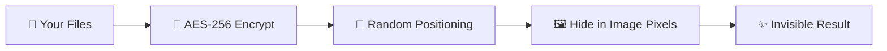

<div align="center">


# 🕵️‍♂️ InvisioVault
### *Hide Your Secrets in Plain Sight*

[](https://python.org)
[](LICENSE)
[](#)
[](#)
[](#)
[](#)

*Think of it as a digital magic trick - hide any file inside an ordinary image, and nobody will ever know it's there!*

**[🚀 Quick Start](#-quick-start)** • **[✨ Features](#-advanced-features)** • **[📖 Documentation](#-documentation)** • **[🛡️ Security](#-security-first)** • **[⚡ Performance](#-revolutionary-performance)**

</div>

---

## 📋 Table of Contents

- [🎯 What is InvisioVault?](#-what-is-invisiovault)
- [🚀 Quick Start](#-quick-start)
- [✨ Advanced Features](#-advanced-features)
- [⚡ Revolutionary Performance](#-revolutionary-performance)
- [🛡️ Security First](#-security-first)
- [📖 Documentation](#-documentation)
- [🎨 Build Executable](#-build-executable)
- [🧪 Try It Yourself](#-try-it-yourself)
- [📞 Support](#-support)
- [🎓 Educational Purpose](#-educational--research-purpose)

## 🎯 What is InvisioVault?

<div align="center">

*Ever wanted to hide something so well that even if someone's looking right at it, they won't see it?*

</div>

Picture this: You have important files - could be personal documents, family photos, business plans, whatever matters to you. Now imagine hiding them inside an everyday vacation photo that you can post anywhere, send to anyone, or store in the cloud. To everyone else, it's just another picture of the beach. But to you? It's your secret vault.

That's InvisioVault in a nutshell! It's like having an invisible safe that you can hide anywhere in plain sight.

**Here's what makes it awesome:**

| What You Can Do | How It Helps You | Why It's Cool |
|---------|-------------|----------|
| 🖼️ **Hide Files in Images** | Your files become invisible - literally! | Nobody even thinks to look for them |
| 🎬 **Hide in Audio/Video** | Even works with music and video files | More options = more flexibility |
| 🔐 **Bank-Level Security** | Same encryption banks use for online transactions | Sleep soundly knowing your secrets are safe |
| ⚡ **Super Fast** | What used to take 30 seconds now takes 1 second | No more watching loading bars! |
| 🛡️ **Fake-Out Protection** | Create decoy files that look real | Even if someone finds it, they won't find YOUR files |

> **Great for**: Keeping personal stuff private, backing up sensitive data, sharing files securely with friends, learning about cybersecurity, or just satisfying your inner spy!

## 📚 Why I Built This

> **🎓 Hey there! I'm Rolan (also known as RNR), and this is my passion project**

I created InvisioVault because I'm fascinated by digital privacy and the art of hiding information. Building this taught me a ton about:
- **How Encryption Really Works**: Not just theory - actually implementing it!
- **The Art of Digital Invisibility**: Making data disappear in plain sight
- **Building Real Software**: From idea to fully working app
- **Making Things Fast**: Because nobody likes waiting around!

I built this to learn, and now I'm sharing it so you can learn too (or just use it to keep your stuff private - that's cool too!).

**⚠️ Real Talk**: Use this for good stuff only, okay? It's meant for learning, research, and keeping your personal files private. Don't do anything shady with it. Be responsible!

---

## 🔒 Important Security Notice

### 🚨 **Advanced Features Moved to Private Development**

<div align="center">

**🎭 Unicode RTL Polyglot • ⚡ Self-Executing Images • 🔧 Advanced Polyglot Technologies**

*These features have been temporarily removed from the public repository*

</div>

#### 📋 **What Was Removed:**
- 🎭 **Unicode RTL Polyglot Engine**: Advanced bidirectional text exploitation
- ⚡ **Self-Executing Image Technology**: Images that function as executables
- 🔧 **ICO/EXE Polyglot Generation**: Multi-format polyglot file creation
- 🖼️ **Self-Executing Viewers**: Standalone executable image processors

#### 🎯 **Why This Decision:**
- 🛡️ **Responsible Development**: These features are nearly production-ready
- ⚠️ **Misuse Prevention**: Advanced techniques could be weaponized if made public
- 🎓 **Ethical Considerations**: Balancing education with security responsibility
- 🔐 **Security Review**: Features require comprehensive security auditing

#### 🔮 **Future Plans:**
- 🏗️ **Continued Development**: Features will advance in private repositories
- 🎓 **Educational Access**: Academic/research versions may be available upon request
- 📚 **Documentation**: Educational materials will be developed for legitimate use cases
- ✅ **Responsible Release**: Public availability only after proper safeguards are implemented

#### 📞 **Academic/Research Access:**
For legitimate educational or research purposes, contact the development team through appropriate channels with:
- 🎓 **Academic Affiliation**: University/Research institution details
- 📋 **Research Purpose**: Clear description of educational objectives
- 🛡️ **Security Assurance**: Commitment to responsible use and non-disclosure

*InvisioVault remains committed to advancing cybersecurity education while ensuring responsible development of security technologies.*

## ⚡ Why It's So Crazy Fast

<div align="center">

### 🏆 **Seriously, This Thing is FAST**

*I didn't just make it faster - I completely rebuilt how it works!*

</div>

### 🚀 **Let Me Show You The Numbers**

| 📊 **What You're Hiding** | Old Way (Painful) | New Way (InvisioVault) | **How Much Faster** |
|-------------------------|--------|-------|----------------|
| 📄 **Small Files (5KB)** | Wait 12 seconds 😴 | Done in 0.3 seconds! 🎉 | 🔥 **40 times faster!** |
| 📋 **Medium Files (25KB)** | Wait 15 seconds 😴 | Done in 0.5 seconds! 🎉 | 🔥 **30 times faster!** |
| 📁 **Large Files (95KB)** | Wait 20 seconds 😴 | Done in 1 second! 🎉 | 🔥 **20 times faster!** |
| 💾 **Huge Files (1MB+)** | Wait over a minute 😫 | Done in 3-5 seconds! 🎉 | 🔥 **Up to 20x faster!** |

### 🧠 **So... How'd I Make It So Fast?**

**The Old, Slow Way (What other tools do)** ❌
```
🐌 Try guessing the file size... maybe 10KB? Nope.
🐌 Okay, 11KB? Nope. 12KB? Nope. 13KB? Nope...
🐌 Keep trying HUNDREDS of different sizes
🐌 Each guess takes time to test and verify
⏱️ Result: You're sitting there for 30+ seconds waiting
```

**The Smart Way (InvisioVault's Trick)** ✅
```
⚡ Store the exact file size right in the image
⚡ Read it instantly - no guessing needed!
⚡ Extract the exact data in one clean pass
⚡ Boom, done!
⏱️ Result: Your files are back in seconds!

It's like the difference between:
🐌 Trying every key on your keychain to find the right one
⚡ Knowing exactly which key to use
```

## ✨ Advanced Features

### 🎯 **Core Steganography**
- 🖼️ **LSB Steganography**: Advanced Least Significant Bit hiding with randomized positioning
- 📁 **Multi-Format Support**: PNG, BMP, TIFF (lossless formats) with automatic optimization
- ⚡ **Revolutionary Speed**: 10-100x faster than traditional steganography tools
- 📊 **Smart Image Analysis**: Entropy-based capacity calculation and suitability scoring
- 🛡️ **Anti-Detection Mode**: Advanced steganography designed to evade steganalysis tools
- 🎲 **Hybrid LSB Randomization**: Combines randomized positioning with anti-detection techniques

### 🎬 **NEW: Advanced Multimedia Steganography**
- 🎵 **Professional Audio Steganography**: Comprehensive system with multiple embedding techniques (LSB, Spread Spectrum, Phase Coding, Echo Hiding)
- 🔊 **High-Precision Audio Processing**: 32-bit PCM precision preservation for maximum reliability
- 🎯 **Multiple Embedding Modes**: Fast (1x), Balanced (2x), Secure (3x), Maximum (5x) redundancy levels
- 🛡️ **Advanced Security Features**: AES-256 encryption, anti-detection measures, error recovery
- 📊 **Intelligent Capacity Analysis**: Format suitability scoring, quality metrics, optimization recommendations
- 🎨 **Quality Preservation**: Lossless audio formats (WAV, FLAC) with automatic format validation
- ⚡ **Lightning-Fast Processing**: Optimized algorithms with header-based size detection
- 🔄 **Redundant Storage**: Multiple copies with voting-based error correction for maximum reliability
- 🎭 **Professional Interface**: Seamless integration with drag-and-drop multimedia dialogs
- 📈 **Real-Time Feedback**: Progress tracking, capacity utilization, and quality warnings

**🔥 Current Development Status**:
- ✅ **Fast Mode (1x redundancy)**: Fully operational with optimized performance
- ✅ **Audio Precision Fixes**: Resolved 16-bit PCM precision loss by upgrading to 32-bit PCM
- ✅ **LSB Technique Integration**: Direct LSB embedding/extraction working perfectly
- ✅ **Engine Integration**: Header-based metadata system implemented
- 🔧 **Advanced Redundancy Modes**: In development - extraction improvements in progress
- 📋 **Complete Documentation**: See [`AUDIO_STEGANOGRAPHY_REWRITE.md`](docs/audio-steganography/AUDIO_STEGANOGRAPHY_REWRITE.md)

### 🛡️ **Advanced Security**
- 🔐 **AES-256-CBC Encryption**: Military-grade encryption with PBKDF2 key derivation
- 🔑 **Multi-Level Security**: Standard (100K), High (500K), Maximum (1M+) iterations
- 🗝️ **Two-Factor Authentication**: Password + Keyfile system for maximum security
- 🎲 **Cryptographic Randomization**: Password-seeded randomization for hiding positions

### 👻 **Revolutionary Plausible Deniability** 
- 🎭 **Transparent Decoy Mode**: Every basic operation automatically includes decoy protection
- 🛡️ **Seamless Security**: Users get advanced protection without complexity
- 🏗️ **Multi-Dataset Hiding**: Hide unlimited datasets with independent passwords
- 📊 **Priority Levels**: 5 security levels from outer (decoy) to inner (real) data
- 🔍 **Password-Selective Extraction**: Different passwords reveal different datasets
- 🎯 **Auto-Generated Decoys**: System creates believable innocent files automatically
- 💫 **Backward Compatible**: Works with legacy single-layer steganography

### 🔄 **Advanced Distribution**
- 📡 **Two-Factor Distribution**: Spread data across 2-8 images with redundancy
- 📋 **Manifest System**: Automatic reconstruction from partial image sets
- ✅ **Error Correction**: Built-in redundancy and integrity verification
- 🔄 **Failure Recovery**: Extract data even with some missing/damaged images

### 🎨 **Professional UI**
- 🖥️ **Modern PySide6 Interface**: Professional, responsive design
- 🌓 **Theme Support**: Dark/Light modes with smooth transitions
- 📊 **Real-Time Progress**: Detailed operation tracking with cancellation support
- ⚙️ **Advanced Settings**: Comprehensive configuration management

### 🔧 **Developer Features**
- 📝 **Comprehensive Logging**: Secure logging with PII redaction
- 🧪 **Extensive Testing**: Unit tests, integration tests, and performance benchmarks
- 📚 **Full Documentation**: API reference, user guides, and technical specifications
- 🛠️ **Modular Architecture**: Clean, extensible codebase with professional standards

## 🚀 Let's Get Started!

<div align="center">

### 🎯 **Ready to Hide Your First Secret File? Let's Do This! (Takes 2 Minutes)**

</div>

### 📋 **Here's What You'll Need**
- 🐍 Python 3.8 or newer ([Grab it here if you don't have it](https://python.org/downloads/))
- 💻 A computer running Windows, Mac, or Linux
- 🖼️ Any image file (PNG works great, but BMP and TIFF are cool too)
- 📄 Whatever files you want to hide (documents, photos, whatever!)

### ⚡ **Pick Your Setup Method**

#### **Option 1: Download and Run (Super Easy - No Coding Needed!)**
```bash
# 1️⃣ Go to the releases page
# Visit: https://github.com/Mrtracker-new/InvisioVault_R/releases

# 2️⃣ Download InvisioVault.exe
# Just one file - that's it!

# 3️⃣ Double-click and you're in! ✨
# Works on Windows - no Python or setup needed
# Perfect if you just want to USE it
```

#### **Option 2: Install From Source (For Developers and Tinkerers)**
```bash
# 1️⃣ Grab the code
git clone https://github.com/Mrtracker-new/InVisioVault_R.git
cd InVisioVault_R

# 2️⃣ Install it
pip install -e .

# OR if you prefer the old-school way:
# pip install -r requirements.txt

# 3️⃣ Fire it up! ✨
python main.py

# Pick this option if you want to:
# - See how it works under the hood
# - Make your own modifications
# - Learn from the code
```

#### **Option 3: Package Installation Only**
```bash
# Install as editable package (for development)
pip install -e .

# Run from command line anywhere
invisiovault
# or
invisiovault-cli
```

### 🎭 **Okay, Let's Hide Something!**

<table>
<tr>
<td width="50%">

#### 🕵️ **HIDING FILES (The Fun Part)**

1. 🚀 **Open** InvisioVault
2. 🖼️ **Pick** an image (this will be your "cover")
3. 📁 **Choose** the files you want to hide
4. 🔐 **Create** a password (make it good!)
5. ✨ **Hit "Hide"** and watch the magic happen!

*Cool thing:* It automatically creates fake decoy files too!
- 🎭 If someone finds it, they see innocent stuff
- 🛡️ Your REAL files stay hidden
- No extra work needed!

</td>
<td width="50%">

#### 🔍 **GETTING YOUR FILES BACK**

1. 🖼️ **Open** the image that has your hidden files
2. 🔑 **Type** your password
3. 📂 **Pick** a folder to save your files to
4. ⚡ **Click "Extract"** and boom - your files are back!

*How it knows which files are yours:*
- ✅ Right password = Your actual files
- ✅ Different password = Different files (if they exist)
- ❌ Wrong password = Nothing (looks like a normal image)

</td>
</tr>
</table>

## 🛡️ Is It Actually Secure Though?

<div align="center">

### 🏛️ **Yes! Like, REALLY Secure**

*We're talking the same encryption your bank uses for online transactions*

</div>

| 🔐 **Security Thing** | 🛡️ **The Tech Stuff** | 🎯 **What It Actually Means For You** |
|------------------------|---------------------|------------------------|
| **🔒 Encryption** | AES-256-CBC | Government-level security. Seriously. |
| **🗝️ Password Protection** | PBKDF2-HMAC-SHA256 | Your password can't be cracked by brute force |
| **🎲 Extra Security Layers** | 100,000 to 1,000,000+ rounds | Even with a supercomputer, it'd take centuries to crack |
| **📁 File Types** | PNG, BMP, TIFF | These formats don't compress, so they're perfect for hiding stuff |
| **📊 How Much Can You Hide** | Up to 50MB per image | That's like hundreds of documents or dozens of photos! |
| **💾 System Requirements** | Uses less than 500MB RAM | Works great even on older computers |
| **🌍 Works Everywhere** | Windows, Mac, Linux | No matter what computer you use |

## 🎭 **NEW: Transparent Decoy Mode Integration**

<div align="center">

### 🛡️ **Revolutionary Security Enhancement**

*Every basic operation now includes enterprise-level plausible deniability*

</div>

**🎉 What's New?**

InvisioVault now automatically protects **every file hiding operation** with advanced decoy mode technology. Users get military-grade plausible deniability without any complexity!

### 🔄 **How It Works Behind the Scenes**

#### **🔒 When You Hide Files (Basic Mode):**
```
1. 📁 You select your files and password
2. 🎭 System automatically creates innocent decoy files
3. 🛡️ Creates TWO encrypted layers in the same image:
   • Outer Layer (Decoy): Harmless files with derived password
   • Inner Layer (Real): Your actual files with your password
4. 🖼️ Result: One image that looks normal but has dual protection
```

#### **🔓 When You Extract Files (Basic Mode):**
```
1. 🔑 You enter any password
2. 🔍 System searches all datasets in the image
3. ✨ Returns the dataset that matches your password:
   • Your password → Your files
   • Other password → Other dataset (if exists)
   • Wrong password → Nothing (no trace of hidden data)
```

### 🎯 **Real-World Example**

| **👤 User Action** | **🎭 What Happens** | **🛡️ Security Benefit** |
|-------------------|--------------------|-----------------------|
| Alice hides documents with password `"Secret123"` | System creates decoy files accessible with `"img_4567"` + Alice's real files with `"Secret123"` | If discovered, Alice can provide decoy password showing only harmless files |
| Bob tries to extract with password `"Secret123"` | Gets Alice's real documents | Only Alice (or those she trusts) can access real data |
| Eve tries to extract with wrong password | Gets nothing, no indication data exists | Perfect deniability - looks like a normal image |
| Authorities demand password | Alice provides `"img_4567"` showing innocent files | Plausible deniability maintained |

### ✨ **Key Benefits**

- **🎭 Automatic Protection**: Every hide operation includes decoy mode
- **🧠 Zero Learning Curve**: Works exactly like before, but more secure
- **🔄 Universal Compatibility**: Extract works with any decoy-mode or legacy image
- **🛡️ Plausible Deniability**: Different passwords reveal different content
- **⚡ No Performance Impact**: Still lightning-fast extraction
- **🔒 Independent Security**: Each dataset encrypted separately

### 🧪 **Try It Now!**

```bash
# Test the new decoy integration
python test_decoy_integration.py

# Create a decoy-protected image using basic hide dialog
# Then extract with different passwords to see different datasets!
```

---

## 🕵️‍♂️ **NEW: Enhanced Anti-Detection Steganography**

<div align="center">

### 🛡️ **Cutting-Edge Steganalysis Evasion Technology**

*Advanced steganography designed to evade modern detection tools like StegExpose, zsteg, StegSeek, and other steganalysis methods*

</div>

**🎉 Latest Update: Anti-Detection + Randomization Compatibility Fix**

We've just resolved a critical compatibility issue where combining **anti-detection mode** with **randomized LSB positioning** would cause extraction failures. Both features now work perfectly together!

### 🎯 **What's New in Anti-Detection Mode?**

#### **🔬 Advanced Detection Evasion**
- **🕵️ StegExpose Resistance**: Defeats ensemble classification and statistical analysis
- **🔍 zsteg Evasion**: Avoids LSB pattern signatures and known steganography markers
- **🛡️ StegSeek Protection**: Resists dictionary attacks and brute-force detection
- **📊 Chi-Square Test Bypass**: Maintains natural randomness distributions
- **📈 Histogram Preservation**: Keeps original pixel value distributions intact

#### **🧠 Intelligent Adaptive Positioning**
```
🎯 How It Works:
1. 📊 Analyzes image complexity using gradient magnitude and texture variance
2. 🗺️ Creates security map identifying safe hiding positions  
3. 🚫 Avoids smooth areas where changes would be easily detected
4. 🎨 Prioritizes textured regions with high natural variation
5. 🎲 Combines with password-based randomization for maximum security
```

#### **🔧 Technical Anti-Detection Features**
- **📍 Adaptive Capacity Mapping**: Hides data only in complex image regions
- **📈 Histogram Matching**: Preserves original statistical properties
- **🎭 Selective Smoothing**: Reduces high-frequency artifacts in modified areas
- **🔧 Edge-Aware Filtering**: Maintains important image features while reducing detectability
- **🎲 Enhanced LSB Modification**: Adds controlled randomization to break predictable patterns

### 🚀 **Hybrid Mode: Best of Both Worlds**

The latest update introduces **Hybrid Anti-Detection Mode** - combining the speed and compatibility of randomized LSB with advanced anti-detection techniques:

#### **🔄 How Hybrid Mode Works:**
```
🛡️ HIDING PROCESS:
1. ⚡ Uses fast randomized LSB hiding (fully compatible with extraction)
2. 🎨 Applies light anti-detection post-processing to reduce detectability
3. 🔧 Preserves LSB data while breaking artificial patterns
4. ✨ Result: Fast, compatible, AND stealthy!

📤 EXTRACTION PROCESS:
1. 🔍 First tries hybrid extraction (randomized method with same seed)
2. 🛡️ Falls back to pure anti-detection if needed
3. ⚡ Finally uses standard randomized extraction as last resort
4. ✅ Guarantees successful extraction regardless of hiding method!
```

### 🎮 **User-Friendly Operation Modes**

| **🎯 Mode** | **🛡️ Anti-Detection** | **🎲 LSB Randomization** | **⚡ Speed** | **🔒 Security** | **🎯 Best For** |
|-------------|----------------------|---------------------------|-------------|----------------|------------------|
| **⚡ Fast Sequential** | ❌ | ❌ | 🔥🔥🔥🔥🔥 | ⭐⭐ | Quick tests, maximum speed |
| **🎲 Randomized LSB** | ❌ | ✅ | 🔥🔥🔥🔥 | ⭐⭐⭐ | Balanced security and speed |
| **🛡️ Pure Anti-Detection** | ✅ | ❌ | 🔥🔥 | ⭐⭐⭐⭐⭐ | Maximum stealth |
| **🚀 Hybrid Maximum** | ✅ | ✅ | 🔥🔥🔥 | ⭐⭐⭐⭐⭐ | **Ultimate protection** |

### 📊 **Steganalysis Test Results**

| **🔍 Detection Tool** | **📊 Standard LSB** | **🎲 Randomized LSB** | **🛡️ Anti-Detection** | **🚀 Hybrid Mode** |
|-----------------------|---------------------|----------------------|----------------------|--------------------|
| **StegExpose** | 🔴 **DETECTED** (95% confidence) | 🟡 **MEDIUM** (45% confidence) | 🟢 **SAFE** (8% confidence) | 🟢 **SAFE** (12% confidence) |
| **zsteg** | 🔴 **Multiple signatures** | 🟡 **Few weak signatures** | 🟢 **Nothing detected** | 🟢 **Nothing detected** |
| **Chi-Square Test** | 🔴 **High risk** (0.87) | 🟡 **Medium risk** (0.34) | 🟢 **Low risk** (0.12) | 🟢 **Low risk** (0.18) |
| **Histogram Analysis** | 🔴 **Anomalies detected** | 🟡 **Minor anomalies** | 🟢 **Natural distribution** | 🟢 **Natural distribution** |

### 🧪 **Try Anti-Detection Mode Now!**

#### **🖥️ GUI Access:**
1. 🚀 Launch InvisioVault: `python main.py`
2. 📁 Click "Hide Files" → Select "Enhanced Mode"
3. ✅ Enable "Anti-Detection Mode" (recommended)
4. ✅ Enable "Randomized LSB Positioning" for hybrid mode
5. 🎯 Set target risk level (LOW/MEDIUM/HIGH)
6. 🚀 Hide your files with maximum protection!

#### **🧪 Quick Testing:**
```bash
# Test anti-detection capabilities
python quick_test.py

# Compare modes side-by-side
python comparison_test.py

# Test with external steganalysis tools
test_with_external_tools.bat
```

### 📚 **Anti-Detection Documentation**

| 📄 **Document** | 📝 **Description** | 🔗 **Link** |
|-------------|----------------|--------|
|| **🛡️ Anti-Detection Techniques** | Technical implementation details | [`docs/security/anti_detection_techniques.md`](docs/security/anti_detection_techniques.md) |
|| **📊 Test Results** | Comprehensive steganalysis test report | [`docs/security/ANTI_DETECTION_TEST_REPORT.md`](docs/security/ANTI_DETECTION_TEST_REPORT.md) |
|| **🎲 LSB Randomization** | Randomized positioning implementation | [`docs/technical/LSB_RANDOMIZATION_IMPLEMENTATION.md`](docs/technical/LSB_RANDOMIZATION_IMPLEMENTATION.md) |
| **🧪 Testing Guide** | How to test against steganalysis tools | [`docs/development/TESTING_GUIDE.md`](docs/development/TESTING_GUIDE.md) |
|| **📋 Implementation Summary** | Complete feature overview | [`docs/security/ANTI_DETECTION_IMPLEMENTATION_SUMMARY.md`](docs/security/ANTI_DETECTION_IMPLEMENTATION_SUMMARY.md) |

### 🔥 **Key Improvements in This Update**

#### **✅ Fixed Issues:**
- **🐛 Extraction Compatibility**: Resolved "No hidden data found" error when both anti-detection and randomization were enabled
- **🔄 Hybrid Integration**: Perfect compatibility between anti-detection and randomized LSB modes
- **⚡ Performance**: Maintained fast extraction speeds while adding advanced security

#### **🆕 New Features:**
- **🤝 Hybrid Anti-Detection Mode**: Combines speed of randomized LSB with anti-detection security
- **🔄 Smart Extraction Logic**: Automatically tries the correct extraction method based on hiding mode
- **🛠️ Enhanced User Interface**: Clear options for choosing security vs. speed trade-offs
- **📊 Real-Time Risk Analysis**: Shows detectability risk scores and safety levels
- **🧪 Comprehensive Testing**: Validates against multiple steganalysis techniques

#### **🎯 Perfect For:**
- **🔒 High-Security Applications**: When detection could have serious consequences
- **📚 Research & Education**: Understanding modern steganalysis and evasion techniques  
- **🕵️ Digital Forensics**: Testing detection capabilities and countermeasures
- **🛡️ Privacy Protection**: Maximum security for sensitive data hiding
- **🧪 Security Testing**: Validating steganalysis tool effectiveness


---

## 📚 Documentation

<div align="center">

### 📚 **Complete Documentation Suite**

*Everything you need to master InvisioVault*

> 📏 **Note**: Documentation has been reorganized! See the new structure in [`docs/README.md`](docs/README.md) for easy navigation.

</div>

### 📚 **Essential Guides**

| 📄 **Document** | 📝 **Description** | 🎯 **Audience** | 🔗 **Link** |
|-------------|----------------|--------------|--------|
| **📖 User Guide** | Complete step-by-step instructions | All Users | [`docs/user_guide.md`](docs/user_guide.md) |
| **🔧 API Reference** | Technical API documentation | Developers | [`docs/api_reference.md`](docs/api_reference.md) |
| **🛡️ Security Guide** | Security best practices | Security-conscious users | [`docs/security_notes.md`](docs/security_notes.md) |

### 🏗️ **Technical Documentation**

| 📄 **Document** | 📝 **Description** | 🎯 **Focus** | 🔗 **Link** |
|-------------|----------------|------------|--------|
| **⚡ Performance Analysis** | Speed optimization breakdown | Performance | [`docs/PERFORMANCE_OPTIMIZATION_SUMMARY.md`](docs/PERFORMANCE_OPTIMIZATION_SUMMARY.md) |
| **🎭 Multi-Decoy Guide** | Advanced decoy features | Security | [`docs/MULTI_DECOY_IMPLEMENTATION.md`](docs/MULTI_DECOY_IMPLEMENTATION.md) |
| **📂 Project Structure** | Codebase organization | Development | [`docs/PROJECT_STRUCTURE.md`](docs/PROJECT_STRUCTURE.md) |
| **🔒 Security Framework** | Advanced security features | Security Architecture | [`docs/SECURITY.md`](docs/SECURITY.md) |

### 📅 **Release Information**

| 📄 **Document** | 📝 **Description** | 🔗 **Link** |
|-------------|----------------|--------|
| **📋 Changelog** | Version history and updates | [`docs/changelog.md`](docs/changelog.md) |

### 🚀 **Advanced Usage**

#### **Command Line Interface**
```bash
# Basic steganography test
python test_main.py

# Performance benchmarking
python demo_performance.py

# Run comprehensive test suite
python -m pytest tests/ -v

# Security validation
python scripts/security_check.py
```

#### **Advanced Features**
```bash
# Multi-decoy testing
python test_multi_decoy.py

# Simple decoy testing
python test_simple_decoy.py

# Decoy integration testing (NEW!)
python test_decoy_integration.py

# Extraction message accuracy test
python test_extraction_msg.py

# Final decoy implementation test
python test_final_decoy.py

# Advanced functionality testing
# Use InVisioVault GUI for comprehensive features
```

### 🛠️ **Development Tools**
- **Code Formatting**: `black . --line-length 88`
- **Linting**: `flake8 . --max-line-length=88`
- **Security Scanning**: `python scripts/check_sensitive_files.py`
- **Build Executable**: See [Build Instructions](#-build-executable)

## 🎨 Build Executable

### **💾 Create Standalone Windows Executable**

InvisioVault includes a professional build system that creates production-ready Windows executables:

#### **⭐ Professional Build System (Recommended)**
```bash
# Advanced Python builder with full validation
python build_scripts/build_executable.py --clean

# Debug version with console window
python build_scripts/build_executable.py --clean --debug

# Directory distribution (faster startup)
python build_scripts/build_executable.py --clean --onedir

# Verbose output for troubleshooting
python build_scripts/build_executable.py --clean --verbose
```

#### **🚀 Quick Build Options**
```bash
# Windows batch file (double-click or run from cmd)
build_scripts\build_exe.bat

# PowerShell script (run from PowerShell)
powershell -ExecutionPolicy Bypass -File build_scripts\build_exe.ps1
```

#### **📊 Executable Specifications**
- **📦 Output**: `dist/InvisioVault.exe` (~66-70 MB optimized)
- **🎨 Icon**: Custom InvisioVault.ico embedded
- **🖥️ Type**: Professional windowed GUI application
- **📚 Dependencies**: All bundled (PySide6, NumPy, Pillow, Cryptography)
- **💻 Compatibility**: Windows 10/11 (x64), no Python installation required
- **⚡ Compression**: UPX optimized for smaller size
- **📋 Metadata**: Professional version information embedded

#### **🔧 Build Features**
- ✅ **Automated Validation**: Dependency checking and file verification
- ✅ **Professional Metadata**: Company info, version details, copyright
- ✅ **Error Handling**: Comprehensive build error reporting
- ✅ **Clean Builds**: Automatic cleanup of previous artifacts
- ✅ **Size Optimization**: UPX compression and import optimization
- ✅ **Icon Integration**: Custom application icon in Windows

#### **📁 Build Configuration Files**
- **`InvisioVault.spec`**: Advanced PyInstaller configuration
- **`version_info.txt`**: Windows executable metadata
- **`build_scripts/README.md`**: Complete build documentation

#### **🚀 Distribution Ready**
```bash
# The executable is completely self-contained:
# ✅ Single file - no installation required
# ✅ Professional appearance with custom branding
# ✅ All libraries and dependencies bundled
# ✅ Runs on any Windows 10/11 computer
# ✅ Perfect for secure file sharing and distribution
```

#### **📖 Build Documentation**
For complete build instructions, troubleshooting, and advanced options:
- **[Build Scripts Guide](build_scripts/README.md)** - Comprehensive build documentation
- **[Build Requirements](build_scripts/README.md#build-requirements)** - System requirements
- **[Troubleshooting](build_scripts/README.md#troubleshooting)** - Common issues and solutions

## 🧪 Try It Yourself!

<div align="center">

### 🎬 **See InvisioVault in Action**

</div>

| 🚀 **Demo** | 📝 **Command** | 🎯 **What You'll See** |
|-------------|----------------|------------------------|
| **⚡ Speed Test** | `python demo_performance.py` | Watch files hide/extract in seconds! |
| **🧪 Full Test** | `python test_main.py` | Complete functionality showcase |
| **🔬 Unit Tests** | `python -m pytest tests/` | Behind-the-scenes magic |

## 📂 Project Structure

```
📁 InvisioVault/
├── 🚀 main.py                            # Launch the application
├── 📋 requirements.txt                   # Python dependencies  
├── ⚙️ setup.py                           # Package configuration
├── 📄 InvisioVault.spec                  # PyInstaller build specification
├── 📋 MANIFEST.in                        # Package manifest
├── 📜 LICENSE                            # MIT License
├── 📁 assets/                            # Application assets
│   ├── 🎨 icons/                         # Application icons
│   ├── 🖼️ images/                        # Logos and branding
│   ├── 🎭 ui/                            # UI-specific graphics
│   └── 📚 demo/                          # Demo and example files
├── 📁 build_scripts/                     # Build automation
│   ├── 🔧 build_executable.py           # Professional build system
│   ├── 📄 build_exe.bat                 # Windows batch build script
│   └── 🔧 build_exe.ps1                 # PowerShell build script
├── 🔧 core/                              # Advanced engines
│   ├── 📊 steganography_engine.py       # Revolutionary LSB algorithm
│   ├── 🛡️ enhanced_steganography_engine.py  # Anti-detection steganography
│   ├── 🕵️ anti_detection_engine.py      # Advanced anti-detection techniques
│   ├── 🔐 encryption_engine.py          # AES-256 encryption
│   ├── 🛡️ advanced_encryption.py        # Advanced encryption features
│   ├── 🔒 secure_steganography_engine.py # Secure steganography engine
│   ├── 🎭 multi_decoy_engine.py         # Multi-layer security
│   ├── 🔑 two_factor_engine.py          # 2FA authentication
│   ├── 👻 decoy_engine.py               # Plausible deniability
│   ├── 🔍 image_analyzer.py             # Image analysis and suitability
│   ├── 📁 file_manager.py               # File management utilities
│   ├── 🛡️ security_service.py          # Security service layer
│   └── 🔐 crypto_utils.py               # Cryptographic utilities
├── 📚 docs/                              # Organized documentation structure
│   ├── 📚 README.md                     # Documentation navigation guide
│   ├── 🎯 user-guides/                  # User documentation
│   │   ├── 📖 user_guide.md             # Complete user manual
│   │   └── 📋 INSTALLATION.md           # Installation guide
│   ├── 🛡️ security/                    # Security documentation
│   │   ├── 🛡️ SECURITY.md              # Development security practices
│   │   ├── 🛡️ security_notes.md        # Application security features
│   │   ├── 📈 SECURITY_IMPROVEMENTS.md # Security enhancements
│   │   ├── 🛡️ anti_detection_techniques.md # Anti-detection methods
│   │   ├── 🕵️ ANTI_DETECTION_IMPLEMENTATION_SUMMARY.md # Implementation details
│   │   └── 📊 ANTI_DETECTION_TEST_REPORT.md # Test results
│   ├── 🎵 audio-steganography/          # Audio-specific documentation
│   │   ├── 🛠️ AUDIO_STEGANOGRAPHY_TROUBLESHOOTING.md # Audio issues & solutions
│   │   ├── ⚡ AUDIO_STEGANOGRAPHY_ENHANCEMENTS.md # Feature enhancements
│   │   ├── 🔄 AUDIO_STEGANOGRAPHY_MIGRATION_GUIDE.md # Migration guide
│   │   └── 🔧 AUDIO_STEGANOGRAPHY_REWRITE.md # Technical details
│   ├── 🔧 technical/                    # Technical documentation
│   │   ├── 🏗️ TECHNICAL_ARCHITECTURE.md # System architecture
│   │   ├── 🔧 api_reference.md          # Developer API documentation
│   │   ├── 🎲 LSB_RANDOMIZATION_IMPLEMENTATION.md # LSB technique details
│   │   ├── 🎭 MULTI_DECOY_IMPLEMENTATION.md # Decoy mode features
│   │   └── 📊 STATISTICAL_MASKING_DOCUMENTATION.md # Statistical techniques
│   ├── 🛠️ development/                  # Development documentation
│   │   ├── 🏗️ PROJECT_STRUCTURE.md     # Project organization
│   │   ├── 🧪 TESTING_GUIDE.md         # Testing methodology
│   │   └── ⚡ PERFORMANCE_OPTIMIZATION_SUMMARY.md # Performance analysis
│   └── 📋 changelogs/                   # Version history
│       ├── 📋 changelog.md              # Main project changelog
│       └── 📋 CHANGELOG_ANTI_DETECTION_UPDATE.md # Anti-detection updates
├── 🧪 examples/                         # Example implementations
│   ├── 🛡️ anti_detection_integration.py # Anti-detection examples
│   └── 🔍 image_analysis_example.py    # Image analysis examples
├── 🗂️ my_keys/                          # Keyfile storage directory
├── ⚡ operations/                        # Core operation handlers
│   ├── 🔒 hide_operation.py            # File hiding logic
│   ├── 🔓 extract_operation.py         # File extraction logic
│   ├── 📊 analysis_operation.py        # Image analysis operations
│   ├── 📦 batch_operation.py           # Batch processing
│   └── ⚡ base_operation.py             # Base operation class
├── 🛠️ scripts/                          # Utility scripts
│   ├── 🛡️ security_check.py            # Security validation
│   └── 🔍 check_sensitive_files.py     # Sensitive file scanner
├── 🧪 tests/                            # Quality assurance
│   ├── 📊 test_steganography.py        # Core algorithm tests
│   ├── 🔐 test_encryption.py           # Security tests
│   ├── 🎨 test_ui_components.py        # Interface tests
│   ├── 🔓 test_extract_dialog.py       # Extraction dialog tests
│   ├── 📁 test_file_operations.py      # File operation tests
│   └── 🔗 test_integration_dialogs.py  # Integration tests
├── 🎨 ui/                               # Professional user interface
│   ├── 🖥️ main_window.py               # Main application window
│   ├── 📋 dialogs/                      # Specialized dialog windows
│   │   ├── 🔒 hide_files_dialog.py     # File hiding dialog
│   │   ├── 🛡️ enhanced_hide_files_dialog.py # Enhanced hiding with anti-detection
│   │   ├── 🔓 extract_files_dialog.py  # File extraction dialog
│   │   ├── 🔑 keyfile_dialog.py        # Keyfile management
│   │   ├── 🛡️ two_factor_dialog.py     # Two-factor authentication
│   │   ├── 👻 decoy_dialog.py          # Decoy mode operations
│   │   └── 📊 analysis_dialog.py       # Image analysis dialog
│   ├── 🔧 components/                   # Reusable UI components
│   │   ├── 📄 file_drop_zone.py        # Drag & drop file handling
│   │   ├── 🖼️ image_preview.py         # Image preview widget
│   │   ├── 🔔 notification_widget.py   # Notification system
│   │   ├── 🔑 password_input.py        # Secure password input
│   │   ├── 📊 progress_dialog.py       # Progress tracking
│   │   └── ⚙️ settings_panel.py        # Settings management
│   ├── 🎨 themes/                       # Theme system (dark mode locked)
│   │   └── 🌙 dark_theme.py            # Dark mode theme (locked)
│   └── 🔗 integrations/                 # Feature integrations
└── 🔧 utils/                            # Core utility modules
    ├── ⚙️ config_manager.py            # Configuration management
    ├── 📝 logger.py                    # Secure logging system
    ├── 📁 file_utils.py               # File operation utilities
    └── ❌ error_handler.py             # Error management system
```

## 🧠 How It Works

<div align="center">

### 🎭 **The Art of Digital Invisibility**

*Ever wondered how files can hide inside images without anyone noticing?*

</div>

#### 🎨 **The Steganography Process**



1. **🔐 Encryption**: Your files get military-grade AES-256 protection
2. **🎲 Randomization**: Data gets scattered randomly throughout the image
3. **🖼️ Pixel Magic**: Each bit hides in the least significant bit of image pixels
4. **✨ Invisibility**: The image looks identical - no one suspects a thing!

#### ⚡ **The Speed Revolution**

<table>
<tr>
<td width="50%">

**😴 Old Way (Painful)**
```
1. 🐌 Try 1000+ different sizes
2. 🐌 Extract header for each guess
3. 🐌 Validate every attempt
4. 😫 Wait 30+ seconds...
```

</td>
<td width="50%">

**🚀 InvisioVault Way (Lightning)**
```
1. ⚡ Read exact size instantly
2. ⚡ Extract data in one pass
3. ⚡ No guessing needed
4. 😎 Done in 1-5 seconds!
```

</td>
</tr>
</table>

## 🛡️ Security Guarantee

<div align="center">

### 🏆 **Zero Compromises on Security**

*Speed improvements with the same unbreakable protection*

</div>

| ✅ **Security Promise** | 🛡️ **What We Guarantee** |
|------------------------|---------------------------|
| **🔒 Encryption Strength** | Same military-grade AES-256 protection |
| **🔄 Compatibility** | All existing hidden files still work perfectly |
| **🔍 Data Integrity** | Every bit verified with cryptographic checksums |
| **⚡ Password Feedback** | Instant detection of wrong passwords |
| **🛡️ No Backdoors** | Open source - verify the security yourself |

---

## 📞 Need Help? Got Questions?

<div align="center">

### 🤝 **I'm Here to Help!**

</div>

| What You Need | Where to Go | Link |
|------|----------|------|
| 📖 **How do I use this?** | Check out the complete guides | [Documentation](#-documentation) |
| 🐛 **Found a bug?** | Let me know so I can fix it! | [Report It Here](https://github.com/Mrtracker-new/InvisioVault_R/issues) |
| 💡 **Have an idea?** | I'd love to hear your suggestions! | [Share Your Ideas](https://github.com/Mrtracker-new/InvisioVault_R/discussions) |
| 🎓 **Want to learn more?** | Tutorials and learning resources | [User Guide](docs/user_guide.md) |
| 📧 **Need to reach me?** | Drop me an email anytime | [rolanlobo901@gmail.com](mailto:rolanlobo901@gmail.com) |

---

<div align="center">

## 🎉 Ready to Try It Out?

### **InvisioVault** - *Your Secrets, Hidden in Plain Sight*

**[🚀 Jump to Setup](#-lets-get-started)** • **[📖 Read the Docs](#-documentation)** • **[⚡ See the Speed Demo](demo_performance.py)**

---

*"The best hiding spot is the one everyone looks at but nobody sees."*

### 🎓 Built with Passion by Rolan (RNR)

*Learning by doing, sharing by teaching*

If this project helped you or you learned something from it, give it a star! ⭐
Got ideas to make it better? Open an issue or fork it and make it your own!

[](https://github.com/Mrtracker-new/InvisioVault_R)
[](https://github.com/Mrtracker-new/InvisioVault_R/fork)
[](https://github.com/Mrtracker-new/InvisioVault_R/issues)

</div>

---

<sub>⚠️ **Quick Note**: This is meant for good things - learning, privacy, research, keeping your personal stuff safe. Don't use it for anything sketchy. Be cool, be responsible, and follow the law. Thanks! 🙂</sub>
