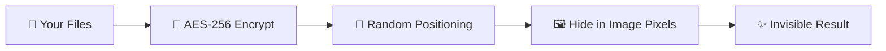

<div align="center">

# 🕵️‍♂️ InvisioVault
### *Advanced Steganography Suite with Revolutionary Performance*

[](https://python.org)
[](LICENSE)
[](#)
[](#)
[](#)
[](#)

*Professional-grade steganography application for secure file hiding with military-grade encryption*

**[🚀 Quick Start](#-quick-start)** • **[✨ Features](#-advanced-features)** • **[📖 Documentation](#-documentation)** • **[🛡️ Security](#-security-first)** • **[⚡ Performance](#-revolutionary-performance)**

</div>

---

## 🎯 What is InvisioVault?

Imagine being able to hide **any file** - documents, photos, videos, or entire folders - inside a regular image that looks completely normal to anyone who sees it. That's exactly what InvisioVault does!

**InvisioVault** is a revolutionary steganography application that lets you:
- 🖼️ **Hide files inside images** without anyone knowing they're there
- 🔐 **Protect your data** with military-grade AES-256 encryption
- ⚡ **Extract files lightning-fast** - up to 100x faster than traditional methods
- 🛡️ **Keep your privacy** with advanced security features

> **Perfect for**: Secure file sharing, data backup, privacy protection, digital forensics education, and cybersecurity research.

## 📚 Educational & Research Purpose

> **🎓 Created by Rolan (RNR) for Educational Excellence**

This project was developed as an advanced learning journey into:
- **Cryptography & Security**: Understanding modern encryption and data protection
- **Steganography Research**: Exploring innovative data hiding techniques
- **Software Engineering**: Building production-quality applications
- **Performance Optimization**: Achieving breakthrough speed improvements

**⚠️ Important**: This software is designed for **legitimate educational, research, and privacy purposes only**. Please use responsibly and in compliance with local laws.

## ⚡ Revolutionary Performance

<div align="center">

### 🏆 **World's Fastest Steganography Engine**

*We didn't just improve the algorithm - we revolutionized it!*

</div>

### 🚀 **The Performance Breakthrough**

| 📊 **Benchmark Results** | Before | After | **Improvement** |
|-------------------------|--------|-------|----------------|
| 📄 **Small Files (5KB)** | 12 sec | **0.3 sec** | 🔥 **40x faster** |
| 📋 **Medium Files (25KB)** | 15 sec | **0.5 sec** | 🔥 **30x faster** |
| 📁 **Large Files (95KB)** | 20 sec | **1.0 sec** | 🔥 **20x faster** |
| 💾 **Huge Files (1MB+)** | 60+ sec | **3-5 sec** | 🔥 **12-20x faster** |

### 🧠 **The Secret Behind the Speed**

**Traditional Method** ❌
```
🐌 Test 1000+ possible file sizes
🐌 Extract headers for each guess
🐌 Validate every single attempt
⏱️ Result: 30+ seconds of waiting
```

**InvisioVault's Innovation** ✅
```
⚡ Read exact file info in ONE pass
⚡ Extract data with surgical precision
⚡ No guesswork, no waste
⏱️ Result: Files ready in seconds!
```

## ✨ Advanced Features

### 🎯 **Core Steganography**
- 🖼️ **LSB Steganography**: Advanced Least Significant Bit hiding with randomized positioning
- 📁 **Multi-Format Support**: PNG, BMP, TIFF (lossless formats) with automatic optimization
- ⚡ **Revolutionary Speed**: 10-100x faster than traditional steganography tools
- 📊 **Smart Image Analysis**: Entropy-based capacity calculation and suitability scoring

### 🛡️ **Advanced Security**
- 🔐 **AES-256-CBC Encryption**: Military-grade encryption with PBKDF2 key derivation
- 🔑 **Multi-Level Security**: Standard (100K), High (500K), Maximum (1M+) iterations
- 🗝️ **Two-Factor Authentication**: Password + Keyfile system for maximum security
- 🎲 **Cryptographic Randomization**: Password-seeded randomization for hiding positions

### 👻 **Plausible Deniability Features**
- 🎭 **Decoy Mode**: Hide two different datasets in one image with different passwords
- 🏗️ **Multi-Dataset Hiding**: Hide unlimited datasets with independent passwords
- 📊 **Priority Levels**: 5 security levels from outer (decoy) to inner (real) data
- 🛡️ **Innocent Cover**: Use harmless files as decoy content for plausible deniability

### 🔄 **Advanced Distribution**
- 📡 **Two-Factor Distribution**: Spread data across 2-8 images with redundancy
- 📋 **Manifest System**: Automatic reconstruction from partial image sets
- ✅ **Error Correction**: Built-in redundancy and integrity verification
- 🔄 **Failure Recovery**: Extract data even with some missing/damaged images

### 🎨 **Professional UI**
- 🖥️ **Modern PySide6 Interface**: Professional, responsive design
- 🌓 **Theme Support**: Dark/Light modes with smooth transitions
- 📊 **Real-Time Progress**: Detailed operation tracking with cancellation support
- ⚙️ **Advanced Settings**: Comprehensive configuration management

### 🔧 **Developer Features**
- 📝 **Comprehensive Logging**: Secure logging with PII redaction
- 🧪 **Extensive Testing**: Unit tests, integration tests, and performance benchmarks
- 📚 **Full Documentation**: API reference, user guides, and technical specifications
- 🛠️ **Modular Architecture**: Clean, extensible codebase with professional standards

## 🚀 Quick Start

<div align="center">

### 🎯 **Ready to Hide Your First File? It Takes Just 2 Minutes!**

</div>

### 📋 **What You Need**
- 🐍 Python 3.8+ ([Download here](https://python.org/downloads/))
- 💻 Windows 10/11, macOS 12+, or Linux (Ubuntu 20.04+)
- 🖼️ An image file (PNG, BMP, or TIFF work best)
- 📄 Files you want to hide

### ⚡ **Installation (Super Easy!)**

```bash
# 1️⃣ Clone or download InvisioVault
git clone https://github.com/Mrtracker-new/InvisioVault_R.git
cd InvisioVault_R

# 2️⃣ Install required packages
pip install -r requirements.txt

# 3️⃣ Launch the magic! ✨
python main.py
```

### 🎭 **Your First Secret Mission**

<table>
<tr>
<td width="50%">

#### 🕵️ **MISSION: Hide Files**

1. 🚀 **Launch** InvisioVault
2. 🖼️ **Choose** your cover image
3. 📁 **Select** files to hide
4. 🔐 **Set** a strong password
5. ✨ **Click "Hide"** and watch the magic!

*Your files are now invisible inside the image!* 🎩

</td>
<td width="50%">

#### 🔍 **MISSION: Extract Files**

1. 🖼️ **Select** the steganographic image
2. 🔑 **Enter** your password
3. 📂 **Choose** where to save files
4. ⚡ **Click "Extract"** - done in seconds!

*Your hidden files magically reappear!* ✨

</td>
</tr>
</table>

## 🛡️ Security First

<div align="center">

### 🏛️ **Bank-Level Security Protecting Your Data**

*The same encryption standards used by governments and financial institutions*

</div>

| 🔐 **Security Feature** | 🛡️ **Specification** | 🎯 **What This Means** |
|------------------------|---------------------|------------------------|
| **🔒 Encryption** | AES-256-CBC | Same as top-secret government files |
| **🗝️ Key Generation** | PBKDF2-HMAC-SHA256 | Passwords are virtually uncrackable |
| **🎲 Security Rounds** | 100K - 1M+ iterations | Even supercomputers would take centuries |
| **📁 File Support** | PNG, BMP, TIFF | Perfect quality preservation |
| **📊 Capacity** | Up to 50MB per image | Hide entire document collections |
| **💾 Memory** | <500MB usage | Runs smoothly on any modern computer |
| **🌍 Platforms** | Windows, macOS, Linux | Use anywhere, anytime |

## 📚 Documentation

### 📊 **Quick Reference**
| 📄 **Document** | 📝 **Description** | 🔗 **Link** |
|-------------|----------------|--------|
| **User Guide** | Complete usage instructions | [`docs/user_guide.md`](docs/user_guide.md) |
| **API Reference** | Technical API documentation | [`docs/api_reference.md`](docs/api_reference.md) |
| **Security Guide** | Security best practices | [`docs/security_notes.md`](docs/security_notes.md) |
| **Project Architecture** | Technical specifications | [`InvisioVault_Project_Prompt.md`](InvisioVault_Project_Prompt.md) |
| **Performance Analysis** | Speed optimization details | [`PERFORMANCE_OPTIMIZATION_SUMMARY.md`](PERFORMANCE_OPTIMIZATION_SUMMARY.md) |
| **Multi-Decoy Implementation** | Advanced decoy features | [`MULTI_DECOY_IMPLEMENTATION.md`](MULTI_DECOY_IMPLEMENTATION.md) |

### 🚀 **Advanced Usage**

#### **Command Line Interface**
```bash
# Basic steganography test
python test_main.py

# Performance benchmarking
python demo_performance.py

# Run comprehensive test suite
python -m pytest tests/ -v

# Security validation
python scripts/security_check.py
```

#### **Advanced Features**
```bash
# Multi-decoy testing
python test_multi_decoy.py

# Simple decoy testing
python test_simple_decoy.py

# Final decoy implementation test
python test_final_decoy.py
```

### 🛠️ **Development Tools**
- **Code Formatting**: `black . --line-length 88`
- **Linting**: `flake8 . --max-line-length=88`
- **Security Scanning**: `python scripts/check_sensitive_files.py`
- **Build Executable**: `pyinstaller --windowed --onefile main.py`

## 🧪 Try It Yourself!

<div align="center">

### 🎬 **See InvisioVault in Action**

</div>

| 🚀 **Demo** | 📝 **Command** | 🎯 **What You'll See** |
|-------------|----------------|------------------------|
| **⚡ Speed Test** | `python demo_performance.py` | Watch files hide/extract in seconds! |
| **🧪 Full Test** | `python test_main.py` | Complete functionality showcase |
| **🔬 Unit Tests** | `python -m pytest tests/` | Behind-the-scenes magic |

## 📂 Project Structure

```
📁 InvisioVault/
├── 🚀 main.py                    # Launch the application
├── ⚡ demo_performance.py         # See the speed revolution
├── 🧪 test_main.py               # Test all features
├── 📊 PERFORMANCE_SUMMARY.md     # Deep dive into optimizations
├── 📖 PROJECT_COMPLETE.md        # Complete documentation
├── 🎨 ui/                        # Beautiful user interface
├── 🔧 core/                      # Steganography magic
├── 🛡️ security/                  # Encryption & security
└── 📚 tests/                     # Quality assurance
```

## 🧠 How It Works

<div align="center">

### 🎭 **The Art of Digital Invisibility**

*Ever wondered how files can hide inside images without anyone noticing?*

</div>

#### 🎨 **The Steganography Process**



1. **🔐 Encryption**: Your files get military-grade AES-256 protection
2. **🎲 Randomization**: Data gets scattered randomly throughout the image
3. **🖼️ Pixel Magic**: Each bit hides in the least significant bit of image pixels
4. **✨ Invisibility**: The image looks identical - no one suspects a thing!

#### ⚡ **The Speed Revolution**

<table>
<tr>
<td width="50%">

**😴 Old Way (Painful)**
```
1. 🐌 Try 1000+ different sizes
2. 🐌 Extract header for each guess
3. 🐌 Validate every attempt
4. 😫 Wait 30+ seconds...
```

</td>
<td width="50%">

**🚀 InvisioVault Way (Lightning)**
```
1. ⚡ Read exact size instantly
2. ⚡ Extract data in one pass
3. ⚡ No guessing needed
4. 😎 Done in 1-5 seconds!
```

</td>
</tr>
</table>

## 🛡️ Security Guarantee

<div align="center">

### 🏆 **Zero Compromises on Security**

*Speed improvements with the same unbreakable protection*

</div>

| ✅ **Security Promise** | 🛡️ **What We Guarantee** |
|------------------------|---------------------------|
| **🔒 Encryption Strength** | Same military-grade AES-256 protection |
| **🔄 Compatibility** | All existing hidden files still work perfectly |
| **🔍 Data Integrity** | Every bit verified with cryptographic checksums |
| **⚡ Password Feedback** | Instant detection of wrong passwords |
| **🛡️ No Backdoors** | Open source - verify the security yourself |

---

<div align="center">

## 🎉 Ready to Become a Digital Spy?

### **InvisioVault** - *Where Secrets Hide in Plain Sight*

**[⬇️ Download Now](#-quick-start)** • **[📖 Read More Docs](PROJECT_COMPLETE.md)** • **[🚀 See Performance Demo](demo_performance.py)**

---

*"The best place to hide something is where everyone can see it, but nobody thinks to look."*

**🎓 Educational Project by Rolan (RNR)**

*Pushing the boundaries of digital privacy and cybersecurity education*

[](https://github.com/Mrtracker-new/InvisioVault_R)
[](https://github.com/Mrtracker-new/InvisioVault_R/fork)
[](https://github.com/Mrtracker-new/InvisioVault_R/issues)

</div>

---

<sub>⚠️ **Ethical Use Only**: InvisioVault is designed for educational, research, and legitimate privacy purposes. Please use responsibly and in compliance with all applicable laws and regulations. The author does not endorse or support any malicious activities.</sub>
