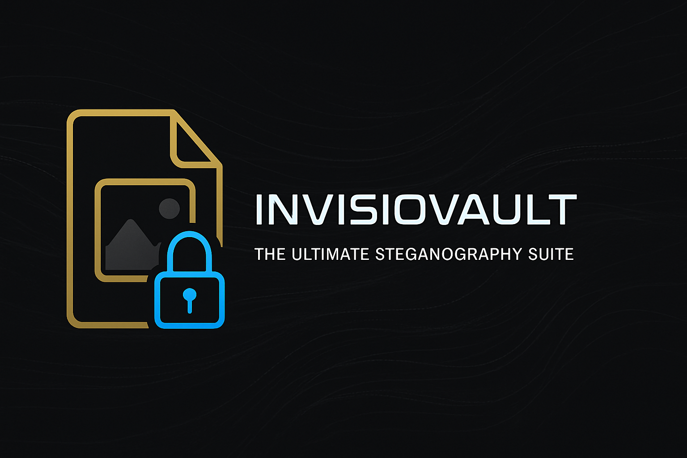

<div align="center">



# 🕵️‍♂️ InVisioVault
### *Hide Your Secrets in Plain Sight*

[](https://python.org)
[](LICENSE)
[](#)
[](#)

**[🚀 Quick Start](#-quick-start)** • **[📖 Full Guide](docs/GUIDE.md)** • **[✨ Features](#-features)**

</div>

---

## 👋 Hey there!

I'm Rolan, and this is InVisioVault - my steganography tool that lets you hide files inside images, videos, and audio. Think of it as a digital magic trick: your files become invisible, hidden in plain sight!

**What makes it special?**
- 🔐 **Bank-level encryption** (AES-256)
- ⚡ **Super fast** (10-100x faster than other tools)
- 🎭 **Automatic decoy protection** (innocent files protect your real ones)
- 🎬 **Works with images, videos, and audio**
- 🛡️ **Evades detection tools** (advanced anti-detection)

> Perfect for keeping personal files private, learning about cybersecurity, or just satisfying your inner spy! 🕵️

---

## 🚀 Quick Start

### Install (2 minutes)

```bash
# Clone the repo
git clone https://github.com/Mrtracker-new/InVisioVault_R.git
cd InVisioVault_R

# Install
pip install -e .

# Launch!
python main.py
```

### Hide Your First File (1 minute)

1. **Click "Hide Files"** in the app
2. **Choose an image** (PNG, BMP, or TIFF)
3. **Select files** to hide
4. **Create a password**
5. **Click "Hide"** - Done! ✨

Your files are now encrypted and invisible inside the image!

### Get Files Back

1. **Click "Extract Files"**
2. **Select the image** with hidden data
3. **Enter your password**
4. **Choose output folder**
5. **Click "Extract"** - Got them back! 🎉

---

## ✨ Features

### 🎯 Core Capabilities
- 🖼️ **Image steganography** - PNG, BMP, TIFF support
- 🎬 **Video steganography** - MP4, AVI, MKV, MOV
- 🎵 **Audio steganography** - MP3, WAV, FLAC, AAC
- 🔐 **Military-grade encryption** - AES-256-CBC
- 🔑 **Two-factor authentication** - Password + keyfile

### 🛡️ Security
- 🎭 **Automatic decoy mode** - Every operation creates innocent-looking decoy files
- 🛡️ **Anti-detection** - Evades steganalysis tools
- 🎲 **Randomized hiding** - Password-seeded positioning
- 🔒 **Multiple security levels** - 100K to 1M+ iterations

### ⚡ Performance
- 🚀 **Revolutionary speed** - 10-100x faster extraction
- 💾 **Memory efficient** - Works great even on older computers
- 🔄 **Batch processing** - Handle multiple files at once
- 📊 **Smart analysis** - Automatic capacity detection

---

## 📖 Documentation

**Want to know more?** Check out the [**Complete Guide**](docs/GUIDE.md) for:
- 📦 Detailed installation instructions
- 🎯 Step-by-step tutorials
- ⚡ Advanced features
- 🏗️ Technical architecture
- 🛡️ Security best practices
- 🐛 Troubleshooting
- 💻 Developer API

---

## 🎨 How It Works

```
📁 Your Files → 🔐 Encrypt → 🎲 Randomize → 🖼️ Hide in Pixels → ✨ Invisible!
```

**The magic:**
1. Your files get encrypted with AES-256
2. Data gets scattered randomly in the image pixels
3. Each bit hides in the least significant bit (LSB)
4. The image looks identical - nobody suspects anything!

**Why it's so fast:**
- Old way: Try 1000+ different sizes, wait 30+ seconds 😴
- My way: Read exact size instantly, done in 1-5 seconds! ⚡

---

## ⚠️ Important Security Note

### Advanced Features Removed

I've temporarily removed some advanced features from public release:
- 🎭 Unicode RTL Polyglot
- ⚡ Self-Executing Images
- 🔧 ICO/EXE Polyglots

**Why?** These features are powerful but could be misused. I'm committed to responsible development and want to ensure proper safeguards before making them publicly available.

For legitimate research/educational access, contact me with your academic affiliation and research purpose.

---

## 🧪 Try It Out

```bash
# Speed test
python demo_performance.py

# Full functionality test
python test_main.py

# Run test suite
python -m pytest tests/ -v
```

---

## 🛠️ Build Executable

Want a standalone Windows executable? Easy!

```bash
# Professional build (recommended)
python build_scripts/build_executable.py --clean

# Or use the batch file
build_scripts\build_exe.bat
```

Creates `dist/InvisioVault.exe` - ready to share!

---

## 📞 Need Help?

| What You Need | Where to Go |
|---------------|-------------|
| 📖 **How to use** | [Complete Guide](docs/GUIDE.md) |
| 🐛 **Found a bug** | [Report it](https://github.com/Mrtracker-new/InVisioVault_R/issues) |
| 💡 **Have an idea** | [Share it](https://github.com/Mrtracker-new/InVisioVault_R/discussions) |
| 📧 **Contact me** | rolanlobo901@gmail.com |

---

## 🎓 Educational Purpose

I built InVisioVault to learn about:
- Cryptography and steganography
- Software architecture
- Performance optimization
- Security best practices

**Use it responsibly!** This is for learning, research, and keeping your personal files private. Always follow your local laws and regulations.

---

<div align="center">

## 🎉 Thanks for checking out InVisioVault!

**[📖 Read the Full Guide](docs/GUIDE.md)** • **[⭐ Star This Repo](https://github.com/Mrtracker-new/InVisioVault_R)**

*Built with passion by Rolan (RNR)*

If this helped you or you learned something, give it a star! ⭐

[](https://github.com/Mrtracker-new/InVisioVault_R)
[](https://github.com/Mrtracker-new/InVisioVault_R/fork)

---

**Version 1.0.0** • **October 2025** • **MIT License**

*"The best hiding spot is the one everyone looks at but nobody sees."* 🕵️

</div>
