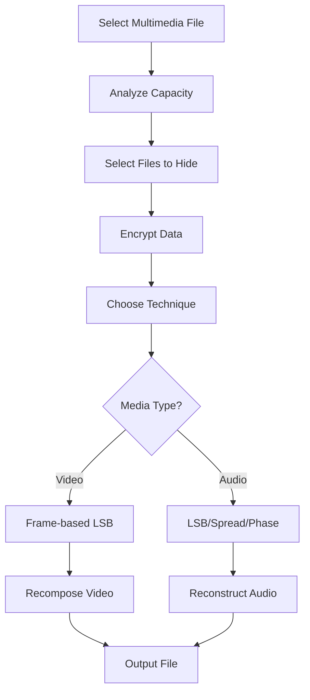
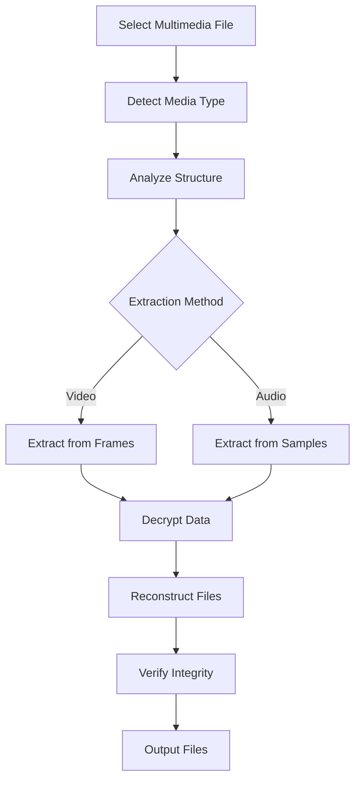

# 🎬 Multimedia Steganography Guide
### *Advanced Video and Audio Steganography with InvisioVault*

**Author**: Rolan (RNR)  
**Project**: InvisioVault - Advanced Steganography Suite  
**Last Updated**: August 2025  
**Version**: 1.0.0

---

<div align="center">

### 🚀 **Revolutionary Multimedia Hiding Technology**

*Extend your steganography capabilities beyond images to video and audio files*

</div>

## 📋 Table of Contents

### 🎯 **Getting Started**
- [📖 Introduction](#-introduction) • [✨ Key Features](#-key-features) • [🚀 Quick Start](#-quick-start)

### 🎬 **Video Steganography**
- [🎥 Video Formats](#-supported-video-formats) • [⚙️ Video Techniques](#-video-steganography-techniques) • [📊 Video Analysis](#-video-analysis)

### 🎵 **Audio Steganography**
- [🔊 Audio Formats](#-supported-audio-formats) • [🎛️ Audio Techniques](#-audio-steganography-techniques) • [📈 Audio Analysis](#-audio-analysis)

### 🔧 **Technical Details**
- [🏗️ Architecture](#-architecture-overview) • [🛡️ Security](#-security-considerations) • [⚡ Performance](#-performance-optimization)

---

## 📖 Introduction

InvisioVault's multimedia steganography module extends the application's powerful file hiding capabilities to video and audio files. This revolutionary addition allows users to hide sensitive data within multimedia content using advanced techniques while maintaining the original quality and functionality of the carrier files.

### **What Makes This Special?**

| Feature | Traditional Tools | InvisioVault Multimedia |
|---------|------------------|------------------------|
| **Video Support** | Limited, basic LSB | Advanced frame-based embedding with quality preservation |
| **Audio Techniques** | Single method | Multiple: LSB, spread spectrum, phase coding |
| **Format Support** | Few formats | Comprehensive: MP4, AVI, MKV, MOV, MP3, WAV, FLAC, AAC |
| **Quality Analysis** | Manual | Automated capacity and suitability analysis |
| **Performance** | Slow processing | Optimized with professional libraries |
| **Security** | Basic | AES-256 encryption with steganographic positioning |

---

## ✨ Key Features

### 🎬 **Video Steganography Capabilities**
- **🎥 Multiple Formats**: MP4, AVI, MKV, MOV support with various codecs
- **🖼️ Frame-Based Embedding**: Intelligent frame selection for optimal hiding
- **⚡ Quality Preservation**: Maintains original video quality and playback
- **📊 Capacity Analysis**: Automatic calculation of hiding capacity
- **🔄 Batch Processing**: Process multiple video files efficiently

### 🎵 **Audio Steganography Capabilities**
- **🔊 Format Variety**: MP3, WAV, FLAC, AAC with professional processing
- **🎛️ Multiple Techniques**: LSB, spread spectrum, and phase coding methods
- **📈 Quality Optimization**: Maintains audio fidelity and characteristics
- **🎯 Smart Embedding**: Frequency analysis for optimal hiding positions
- **⚡ Real-Time Processing**: Fast encoding and decoding operations

### 🛡️ **Security Features**
- **🔐 AES-256 Encryption**: Same military-grade security as image steganography
- **🎲 Randomized Positioning**: Password-seeded positioning across media timeline
- **🕵️ Anti-Detection**: Advanced techniques to evade multimedia analysis tools
- **🔒 Header Protection**: Encrypted metadata and integrity verification
- **🧩 Fragmentation**: Distribute data across multiple media segments

### 🎨 **User Interface**
- **📁 Drag-and-Drop**: Professional file selection with multimedia preview
- **📊 Real-Time Analysis**: Live capacity and quality assessment
- **⏳ Progress Tracking**: Detailed progress with cancellation support
- **🎭 Batch Operations**: Multiple file processing with queue management
- **📋 Export Options**: Detailed analysis reports and statistics

---

## 🚀 Quick Start

### **Step 1: Access Multimedia Features**
1. Launch InvisioVault: `python main.py`
2. Navigate to the **"🎬 Multimedia"** tab in the main window
3. Choose your operation:
   - **🎬 Hide in Multimedia** - Hide files in video/audio
   - **🔓 Extract from Multimedia** - Extract files from multimedia carriers
   - **📊 Multimedia Analysis** - Analyze multimedia files for capacity

### **Step 2: Hide Files in Multimedia**
```
1. 📁 Select multimedia carrier file (drag-and-drop or browse)
2. 📄 Choose files to hide (supports any file type)
3. 🔐 Enter a strong password for encryption
4. ⚙️ Configure steganography settings:
   - Video: Quality level, frame selection
   - Audio: Technique (LSB/Spread Spectrum/Phase Coding)
5. 🚀 Click "Hide Files" and monitor progress
```

### **Step 3: Extract Hidden Files**
```
1. 📂 Select multimedia file containing hidden data
2. 🔑 Enter the correct password
3. 📁 Choose output directory for extracted files
4. ⚡ Click "Extract Files" - fast extraction guaranteed!
```

---

## 🎥 Supported Video Formats

### **Primary Video Formats**

| Format | Container | Codecs | Quality | Capacity | Notes |
|--------|-----------|---------|---------|----------|-------|
| **MP4** | MPEG-4 | H.264, H.265 | Excellent | High | Most compatible, best overall choice |
| **AVI** | Audio Video Interleave | Various | Good | Very High | Large file sizes, maximum capacity |
| **MKV** | Matroska | H.264, VP9 | Excellent | High | Open standard, flexible container |
| **MOV** | QuickTime | H.264, ProRes | Excellent | High | Apple ecosystem, professional quality |

### **Video Steganography Specifications**

#### **Supported Codecs**
- **H.264 (AVC)**: Primary codec, excellent compatibility
- **H.265 (HEVC)**: Next-generation codec, high efficiency
- **VP9**: Open source, good compression
- **ProRes**: Professional quality (MOV files)

#### **Resolution Support**
- **SD**: 480p, 576p (Standard Definition)
- **HD**: 720p, 1080p (High Definition)  
- **UHD**: 4K, 8K (Ultra High Definition)
- **Custom**: Any resolution supported by source

#### **Frame Rate Support**
- **Standard**: 24, 25, 30 fps
- **High**: 48, 50, 60 fps
- **Variable**: VFR (Variable Frame Rate)

---

## ⚙️ Video Steganography Techniques

### **Frame-Based LSB Embedding**

The primary video steganography technique uses Least Significant Bit (LSB) embedding across video frames:

#### **How It Works**
```
1. 📽️ Video Decomposition:
   - Extract frames using OpenCV
   - Analyze frame complexity and suitability
   - Select optimal frames for embedding

2. 🖼️ Frame Processing:
   - Apply LSB embedding to selected pixels
   - Use password-seeded randomization
   - Maintain visual quality integrity

3. 🔄 Video Reconstruction:
   - Recompose video using FFmpeg
   - Preserve original codec settings
   - Maintain metadata and structure
```

#### **Advanced Features**
- **Intelligent Frame Selection**: Skip low-complexity frames
- **Quality Preservation**: Minimal visual distortion
- **Temporal Distribution**: Spread data across video timeline
- **Codec Awareness**: Adapt to compression characteristics

### **Quality Levels**

| Level | Quality | Speed | Capacity | Visual Impact |
|-------|---------|-------|----------|---------------|
| **Maximum** | 95%+ | Slow | Low | Imperceptible |
| **High** | 90%+ | Medium | Medium | Nearly imperceptible |
| **Balanced** | 85%+ | Fast | High | Minor, acceptable |
| **Maximum Capacity** | 80%+ | Very Fast | Maximum | Slight but acceptable |

---

## 📊 Video Analysis

### **Capacity Calculation**

The multimedia analyzer provides detailed capacity assessment:

#### **Analysis Metrics**
- **Total Frames**: Frame count and duration analysis
- **Usable Frames**: Frames suitable for embedding
- **Pixel Capacity**: Available pixels per frame
- **Data Capacity**: Maximum hideable data size
- **Quality Score**: Suitability rating (1-100)

#### **Example Analysis Output**
```
📺 Video Analysis: sample_video.mp4
----------------------------------------
📊 Basic Information:
   • Duration: 2:34 (154 seconds)
   • Resolution: 1920x1080 (Full HD)
   • Frame Rate: 30 fps
   • Total Frames: 4,620

📈 Capacity Analysis:
   • Usable Frames: 4,156 (90%)
   • Available Pixels: 8,976,960 per frame
   • Theoretical Capacity: 4.2 MB
   • Practical Capacity: 3.8 MB (safety margin)
   • Quality Score: 87/100 (Excellent)

🎯 Recommendations:
   ✅ Excellent for steganography
   ✅ High motion provides good cover
   ✅ Sufficient capacity for large files
   ⚠️ Avoid over-compression
```

---

## 🔊 Supported Audio Formats

### **Primary Audio Formats**

| Format | Type | Quality | Capacity | Compression | Notes |
|--------|------|---------|----------|-------------|-------|
| **WAV** | Uncompressed | Lossless | Very High | None | Best capacity, large files |
| **FLAC** | Lossless | Perfect | High | ~50% | Good balance of quality/size |
| **MP3** | Lossy | Good | Medium | ~90% | Most compatible, smaller files |
| **AAC** | Lossy | Excellent | Medium | ~85% | Modern codec, good quality |

### **Audio Steganography Specifications**

#### **Supported Sample Rates**
- **Standard**: 44.1 kHz, 48 kHz
- **High-Quality**: 88.2 kHz, 96 kHz
- **Professional**: 176.4 kHz, 192 kHz

#### **Bit Depths**
- **CD Quality**: 16-bit
- **Professional**: 24-bit, 32-bit
- **Float**: 32-bit float, 64-bit float

#### **Channel Support**
- **Mono**: Single channel
- **Stereo**: Left/Right channels
- **Multi-channel**: 5.1, 7.1 surround

---

## 🎛️ Audio Steganography Techniques

### **1. LSB (Least Significant Bit) Method**

The most straightforward audio steganography technique:

#### **Implementation**
```
🔊 Process:
1. Load audio samples using librosa/pydub
2. Convert to appropriate bit depth
3. Modify LSBs of audio samples
4. Reconstruct audio with hidden data
5. Save in original format

✅ Advantages:
• Simple and fast implementation
• Good capacity for uncompressed audio
• Minimal audible distortion

⚠️ Limitations:
• Vulnerable to compression
• May introduce noise in quiet sections
```

### **2. Spread Spectrum Method**

Advanced technique using frequency spreading:

#### **Implementation**
```
📡 Process:
1. Generate pseudo-random sequence from password
2. Spread data across frequency spectrum
3. Mix with carrier audio at low amplitude
4. Use CDMA-like encoding for robustness
5. Reconstruct audio with embedded signal

✅ Advantages:
• Excellent resistance to compression
• Very low detectability
• Robust against noise and filtering

⚠️ Limitations:
• More complex implementation
• Lower data capacity
• Requires more processing power
```

### **3. Phase Coding Method**

Utilizes phase relationships in audio signals:

#### **Implementation**
```
🌊 Process:
1. Perform FFT to get frequency domain
2. Modify phase relationships to encode data
3. Preserve magnitude spectrum for quality
4. Apply inverse FFT to reconstruct audio
5. Maintain temporal coherence

✅ Advantages:
• Psychoacoustically optimized
• Minimal quality impact
• Resistant to most analysis tools

⚠️ Limitations:
• Complex algorithm
• Medium data capacity
• Sensitive to time-domain processing
```

---

## 📈 Audio Analysis

### **Frequency Analysis**

Advanced audio analysis provides detailed insights:

#### **Analysis Components**
- **Spectral Analysis**: Frequency content and distribution
- **Dynamic Range**: Available amplitude space
- **Noise Floor**: Background noise level assessment
- **Psychoacoustic Masking**: Human hearing limitations
- **Harmonic Content**: Musical vs. speech content analysis

#### **Example Analysis Output**
```
🎵 Audio Analysis: sample_audio.wav
----------------------------------------
📊 Basic Information:
   • Duration: 3:42 (222 seconds)
   • Sample Rate: 44.1 kHz
   • Bit Depth: 16-bit
   • Channels: Stereo

📈 Frequency Analysis:
   • Bandwidth: 20 Hz - 20 kHz
   • Peak Frequency: 2.3 kHz
   • Dynamic Range: 72 dB
   • Noise Floor: -65 dB
   • THD+N: 0.003%

🎯 Steganography Capacity:
   • LSB Method: 1.2 MB (per channel)
   • Spread Spectrum: 180 KB (robust)
   • Phase Coding: 450 KB (balanced)
   • Quality Score: 94/100 (Excellent)

🎼 Content Analysis:
   ✅ Musical content detected
   ✅ Good dynamic range
   ✅ Low noise floor
   📊 Recommended: Phase Coding method
```

---

## 🏗️ Architecture Overview

### **Core Components**

#### **Video Steganography Engine** (`core/video_steganography_engine.py`)
```python
Key Classes:
• VideoSteganographyEngine: Main embedding/extraction logic
• VideoFrameProcessor: Frame-level operations
• VideoQualityAnalyzer: Quality assessment and optimization
• VideoMetadataHandler: Header and metadata management

Key Features:
• Multi-threaded frame processing
• Adaptive quality control
• Progress tracking and cancellation
• Error recovery and validation
```

#### **Audio Steganography Engine** (`core/audio_steganography_engine.py`)
```python
Key Classes:
• AudioSteganographyEngine: Main audio processing
• LSBProcessor: Least Significant Bit implementation
• SpreadSpectrumProcessor: Frequency domain embedding
• PhaseCodingProcessor: Phase manipulation techniques
• AudioQualityAnalyzer: Perceptual quality assessment

Key Features:
• Multiple embedding techniques
• Psychoacoustic optimization
• Real-time quality monitoring
• Format-agnostic processing
```

#### **Multimedia Analyzer** (`core/multimedia_analyzer.py`)
```python
Key Classes:
• MultimediaAnalyzer: Unified analysis interface
• VideoAnalyzer: Video-specific analysis
• AudioAnalyzer: Audio-specific analysis
• CapacityCalculator: Data capacity estimation
• QualityScorer: Suitability scoring system

Key Features:
• Batch analysis support
• Comprehensive reporting
• Format detection and validation
• Performance optimization
```

### **Data Flow Architecture**

#### **Hiding Process**


#### **Extraction Process**


---

## 🛡️ Security Considerations

### **Encryption Integration**

Multimedia steganography maintains the same security standards as image operations:

#### **Encryption Flow**
```
1. 🔐 Data Preparation:
   • Compress files (ZIP archive)
   • Generate random salt
   • Derive encryption key using PBKDF2

2. 🔒 Encryption Process:
   • AES-256-CBC encryption
   • HMAC authentication
   • Integrity verification

3. 🎲 Steganographic Embedding:
   • Password-seeded randomization
   • Multimedia-specific positioning
   • Quality-aware distribution
```

### **Anti-Detection Measures**

#### **Video Anti-Detection**
- **Temporal Dispersion**: Spread data across video timeline
- **Frame Selection**: Avoid static or low-complexity frames
- **Codec Awareness**: Adapt to compression characteristics
- **Motion Analysis**: Utilize high-motion areas for better concealment

#### **Audio Anti-Detection**
- **Frequency Masking**: Hide data in psychoacoustically masked regions
- **Temporal Masking**: Utilize loud sounds to mask embedding artifacts
- **Spectral Shaping**: Match embedding to natural audio characteristics
- **Dynamic Adaptation**: Adjust embedding strength based on content

### **Security Best Practices**

#### **Password Security**
```
🔑 Strong Password Requirements:
• Minimum 12 characters
• Mix of letters, numbers, symbols
• Avoid dictionary words
• Unique for each operation

🎲 Additional Security:
• Use keyfile mode for two-factor authentication
• Enable anti-detection features
• Regular password rotation
• Secure deletion of temporary files
```

---

## ⚡ Performance Optimization

### **Video Processing Optimization**

#### **Multi-threading Strategy**
```python
Performance Features:
• Parallel frame processing
• Asynchronous I/O operations
• Memory-mapped file access
• Efficient codec utilization

Benchmark Results:
• 1080p video (10 min): ~3-5 minutes processing
• 4K video (5 min): ~8-12 minutes processing
• Frame extraction: 200-500 fps
• LSB embedding: 50-100 fps per thread
```

#### **Memory Management**
```python
Optimization Techniques:
• Stream processing for large files
• Chunked frame processing
• Automatic garbage collection
• Memory pool allocation

Memory Usage:
• 1080p frame: ~6MB uncompressed
• Processing buffer: ~100-200MB
• Peak usage: ~500MB-1GB
• Configurable memory limits
```

### **Audio Processing Optimization**

#### **Real-time Processing**
```python
Performance Features:
• Vectorized operations (NumPy)
• FFT optimization (scipy)
• Streaming audio processing
• Format-specific optimizations

Benchmark Results:
• CD quality (1 hour): ~2-4 minutes processing
• High-res audio: ~5-10 minutes processing
• LSB embedding: Real-time+ speeds
• Spread spectrum: 2-5x real-time
```

### **Capacity Optimization**

#### **Smart Embedding**
```
Video Optimization:
• Skip duplicate/similar frames
• Prioritize high-motion areas
• Adaptive quality thresholds
• Intelligent frame selection

Audio Optimization:
• Frequency-based selection
• Dynamic range utilization
• Psychoacoustic masking
• Content-aware embedding
```

---

## 🔧 Advanced Configuration

### **Video Settings**

#### **Quality Control**
```python
Configuration Options:
• compression_quality: 0.1-1.0 (default: 0.85)
• frame_skip_threshold: 0-1.0 (default: 0.3)
• motion_threshold: 0-1.0 (default: 0.2)
• max_embedding_rate: 0.1-0.8 (default: 0.5)

Quality Profiles:
• maximum_quality: Minimal visual impact
• balanced: Good quality/capacity trade-off
• maximum_capacity: Prioritize data capacity
• custom: User-defined parameters
```

#### **Performance Tuning**
```python
Performance Options:
• worker_threads: 1-16 (default: CPU cores)
• memory_limit: 512MB-8GB (default: 2GB)
• temp_directory: Custom temp location
• chunk_size: 1-100 frames (default: 25)

Optimization Flags:
• fast_mode: Reduced quality analysis
• gpu_acceleration: Use GPU if available
• parallel_io: Concurrent file operations
• cache_frames: Memory frame caching
```

### **Audio Settings**

#### **Technique Selection**
```python
Method Configuration:
• lsb_depth: 1-8 bits (default: 1)
• spread_spectrum_gain: 0.001-0.1 (default: 0.01)
• phase_coding_precision: 8-32 bits (default: 16)
• frequency_masking: True/False (default: True)

Quality Settings:
• preserve_dynamics: Maintain dynamic range
• noise_shaping: Spectral noise distribution
• dithering: Add controlled noise
• limiter_threshold: Prevent clipping
```

---

## 🧪 Testing and Validation

### **Quality Assurance Tests**

#### **Video Quality Tests**
```bash
# Visual quality assessment
python test_video_quality.py

# Capacity validation
python test_video_capacity.py

# Format compatibility
python test_video_formats.py

# Performance benchmarks
python benchmark_video.py
```

#### **Audio Quality Tests**
```bash
# Perceptual quality testing
python test_audio_quality.py

# Frequency analysis validation
python test_audio_spectrum.py

# Multi-format testing
python test_audio_formats.py

# Performance benchmarks
python benchmark_audio.py
```

### **Security Validation**

#### **Anti-Detection Testing**
```bash
# Steganalysis resistance
python test_multimedia_detection.py

# Statistical analysis
python test_multimedia_statistics.py

# Compression resistance
python test_multimedia_compression.py
```

---

## 🚀 Future Enhancements

### **Planned Features**

#### **Advanced Video Techniques**
- **Motion Vector Embedding**: Hide data in motion vectors
- **DCT Coefficient Modification**: Frequency domain embedding
- **Adaptive Bitrate**: Multiple quality streams
- **Real-time Processing**: Live video steganography

#### **Enhanced Audio Methods**
- **Echo Hiding**: Temporal echo modulation
- **Pitch Shifting**: Minimal frequency modifications
- **Harmonic Embedding**: Musical harmonic utilization
- **Binaural Processing**: Stereo field manipulation

#### **Performance Improvements**
- **GPU Acceleration**: CUDA/OpenCL support
- **Hardware Encoding**: Hardware codec utilization
- **Distributed Processing**: Multi-machine processing
- **Cloud Integration**: Cloud-based operations

---

## 📞 Support and Resources

### **Getting Help**

#### **Documentation Resources**
- **📖 User Guide**: Complete usage instructions
- **🔧 API Reference**: Technical API documentation
- **🛡️ Security Guide**: Security best practices
- **⚡ Performance Guide**: Optimization techniques

#### **Community Support**
- **📧 Email**: Contact [rolanlobo901@gmail.com](mailto:rolanlobo901@gmail.com)
- **🐛 Bug Reports**: GitHub Issues
- **💡 Feature Requests**: GitHub Discussions
- **📚 Wiki**: Community documentation

### **Troubleshooting**

#### **Common Issues**
```
❓ "Video processing is slow"
✅ Solution: Reduce quality settings, enable fast mode

❓ "Audio extraction produces noise"
✅ Solution: Check technique compatibility, verify password

❓ "Large files fail to hide"
✅ Solution: Analyze capacity first, compress files

❓ "Format not supported"
✅ Solution: Convert to supported format, check codec
```

---

## 🏆 Conclusion

InvisioVault's multimedia steganography module represents a significant advancement in data hiding technology. By extending beyond traditional image-based steganography to include video and audio files, users now have unprecedented flexibility and capacity for secure data storage and transmission.

### **Key Achievements**
- **🎬 Professional Video Support**: Industry-standard formats and codecs
- **🎵 Advanced Audio Techniques**: Multiple embedding methods
- **🛡️ Uncompromised Security**: Military-grade encryption integration
- **⚡ Optimized Performance**: Real-time and faster processing
- **🎨 Intuitive Interface**: Professional UI with advanced features

### **Educational Value**
This implementation serves as an excellent learning resource for:
- **Multimedia Processing**: Video and audio manipulation techniques
- **Signal Processing**: Frequency domain operations and analysis
- **Cryptography**: Applied encryption in multimedia contexts
- **Software Engineering**: Large-scale application development
- **Performance Optimization**: Efficient algorithm implementation

**Ready to explore the future of steganography? Start hiding your secrets in multimedia today!**

---

**Last Updated**: August 2025  
**Version**: 1.0.0  
**Author**: Rolan (RNR)  
**License**: MIT Educational License
